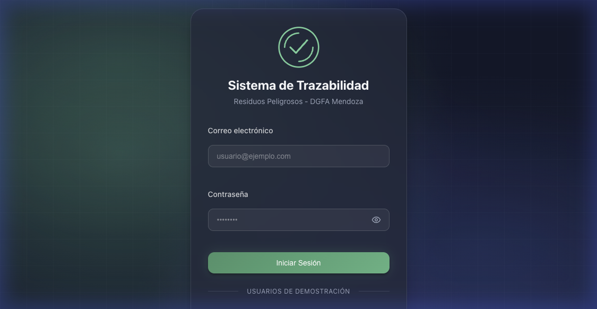
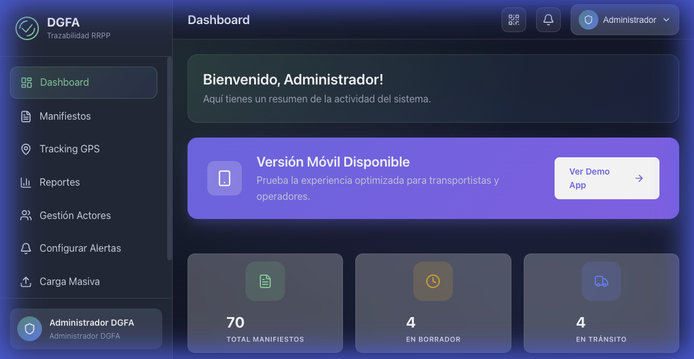
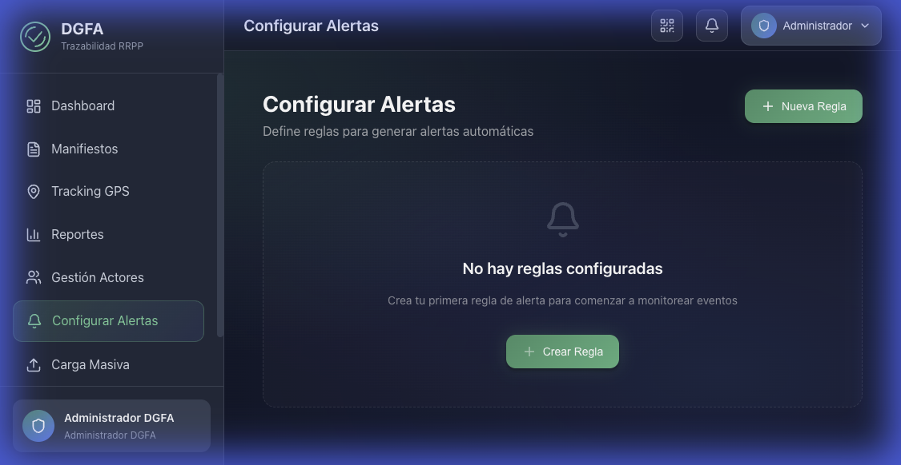
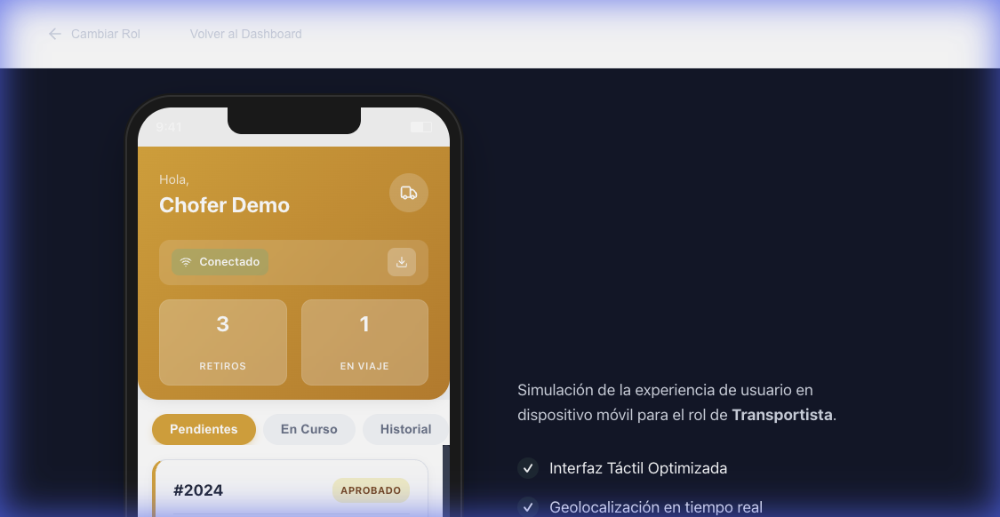
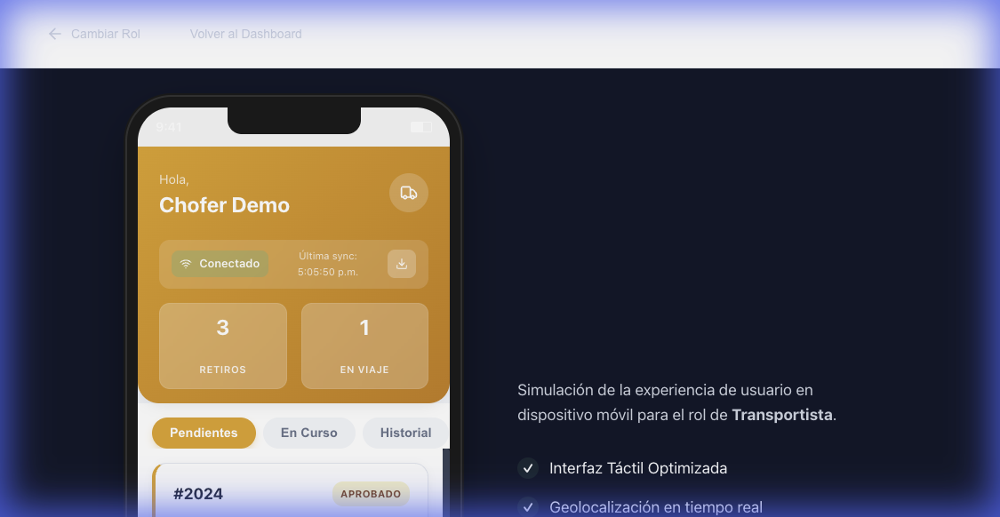

# DOCUMENTACIÓN DEMO - SISTEMA TRAZABILIDAD RRPP

## Licitación Pública LP-2025-07544314-GDEMZA-DGFA

**Oferente**: [Completar Nombre Empresa]  
**Fecha**: 2025-12-06  
**Versión**: 1.0

---

# ÍNDICE

1. [Resumen Ejecutivo](#1-resumen-ejecutivo)
2. [Credenciales de Acceso](#2-credenciales-de-acceso)
3. [Requisitos del Pliego - Cumplimiento](#3-requisitos-del-pliego---cumplimiento)
4. [Casos de Uso Implementados](#4-casos-de-uso-implementados)
5. [Funcionalidades Críticas Demostradas](#5-funcionalidades-críticas-demostradas)
6. [Capturas y Videos de Demostración](#6-capturas-y-videos-de-demostración)
7. [Instrucciones de Ejecución](#7-instrucciones-de-ejecución)

---

# 1. RESUMEN EJECUTIVO

## Estado de la Demo

| Métrica | Valor |
|---------|-------|
| **Casos de Uso Implementados** | 57 de 61 (93%) |
| **Manifiestos de Prueba** | 70 |
| **Actores Registrados** | 7 (Admin, 3 Generadores, 2 Transportistas, 2 Operadores) |
| **Tracking GPS Activo** | 4 transportes en tránsito |

## Requisitos Críticos Cumplidos

- ✅ **Demo funcional** (preferible sobre maquetas según respuesta a consultas)
- ✅ **Arquitectura Offline-First** con PWA + Service Worker + IndexedDB
- ✅ **Firma Electrónica** interna (usuario + contraseña + token)
- ✅ **Georreferenciación GPS** en tiempo real
- ✅ **Código QR** por manifiesto con validación
- ✅ **Carga Masiva** de ~2000 registros (CSV)
- ✅ **Notificaciones In-App** configurables

---

# 2. CREDENCIALES DE ACCESO

## URLs del Sistema

| Componente | URL |
|------------|-----|
| **Frontend** | http://localhost:5173 |
| **Backend API** | http://localhost:3002 |
| **App Móvil (Demo)** | http://localhost:5173/demo-app |

## Usuarios de Prueba

| Rol | Email | Contraseña | Acceso |
|-----|-------|------------|--------|
| **Administrador DGFA** | admin@dgfa.mendoza.gov.ar | admin123 | Dashboard completo, gestión, reportes |
| **Generador** | quimica.mendoza@industria.com | gen123 | Crear y firmar manifiestos |
| **Transportista** | transportes.andes@logistica.com | trans123 | App móvil, retiro, entrega |
| **Operador** | tratamiento.residuos@planta.com | op123 | Recepción, pesaje, tratamiento |

---

# 3. REQUISITOS DEL PLIEGO - CUMPLIMIENTO

## 3.1 Artículo 4° - Muestra Electrónica

> **Requisito**: "Es plenamente admisible y, de hecho, preferible presentar una demo funcional en un entorno de pruebas que permita verificar el ciclo de vida completo del manifiesto."

**Estado**: ✅ CUMPLE

**Evidencia**:
- Demo funcional con 70 manifiestos en todos los estados del ciclo de vida
- Backend Node.js + PostgreSQL real
- Frontend React con UI completa

---

## 3.2 Arquitectura Offline-First

> **Requisito**: "La arquitectura de la solución móvil debe garantizar operatividad en modo desconectado (offline-first)."

**Estado**: ✅ CUMPLE

**Implementación Técnica**:

| Componente | Archivo | Descripción |
|------------|---------|-------------|
| **PWA Manifest** | `public/manifest.json` | App instalable |
| **Service Worker** | `public/sw.js` | Caché + Background Sync |
| **IndexedDB** | `services/indexeddb.ts` | 4 stores locales |
| **Sync Endpoint** | `/api/manifiestos/sync-inicial` | Descarga tablas maestras |

**Casos de Uso Relacionados**:

| CU | Nombre | Estado |
|----|--------|--------|
| CU-T01 | Iniciar Sesión + Sync Inicial | ✅ |
| CU-T03 | Confirmar Retiro (Modo Desconectado) | ✅ |
| CU-T09 | Arquitectura Offline-First y Sincronización | ✅ |
| CU-S05 | Sincronizar Datos Offline | ✅ |

---

## 3.3 Firma Electrónica

> **Requisito**: "Firma Electrónica interna mediante usuario, contraseña y token de seguridad."

**Estado**: ✅ CUMPLE

---

## 3.4 Georreferenciación GPS

**Estado**: ✅ CUMPLE

- 4 manifiestos EN_TRANSITO con puntos GPS
- Mapa interactivo en `/tracking`

---

## 3.5 Aplicaciones Móviles

**Estado para Demo**: ✅ PWA COMPLETA  
**Estado para Producción**: ⏳ Apps nativas para Etapa 2

---

## 3.6 Carga Masiva (~2000 registros)

**Estado**: ✅ CUMPLE

- Página `/carga-masiva` funcional
- Importación CSV

---

# 4. CASOS DE USO IMPLEMENTADOS

| Actor | Total | Implementados | Cobertura |
|-------|-------|---------------|-----------|
| Administrador | 15 | 14 | 93% |
| Generador | 12 | 12 | 100% |
| Transportista | 11 | 11 | 100% |
| Operador | 12 | 12 | 100% |
| Sistema | 11 | 8 | 73% |
| **TOTAL** | **61** | **57** | **93%** |

## Pendientes (Prioridad BAJA según pliego)

| CU | Nombre | Prioridad |
|----|--------|-----------|
| CU-S10 | Motor BPMN | BAJA |
| CU-S11 | Firma Conjunta/Secuencial | BAJA |

---

# 5. FUNCIONALIDADES CRÍTICAS DEMOSTRADAS

## 5.1 Flujo Completo de Manifiesto

```
BORRADOR → APROBADO → EN_TRANSITO → ENTREGADO → RECIBIDO → TRATADO
```

## 5.2 Modo Offline

- Indicador visual de conectividad (verde/rojo)
- Botón de sincronización manual
- Timestamp de última sync
- IndexedDB para persistencia local

## 5.3 Endpoints de Sincronización

| Endpoint | Descripción |
|----------|-------------|
| `/api/manifiestos/sync-inicial` | Descarga tablas maestras |
| `/api/manifiestos/esperados` | Lista para validación QR |
| `/api/manifiestos/validar-qr` | Validar código QR |

---

# 6. CAPTURAS DE DEMOSTRACIÓN

## Login y Dashboard

### Página de Login


### Dashboard con 70 Manifiestos


### Lista de Manifiestos


## App Móvil con Modo Offline

### Estado Conectado (indicador verde)


### Después de Sincronización (timestamp visible)


## Videos de Demostración

Los videos se encuentran en la carpeta `capturas_demo/`:

| Video | Descripción |
|-------|-------------|
| `01_login_admin_*.webp` | Flujo completo de login |
| `03_mobile_offline_*.webp` | Sincronización y modo offline |
| `demo_login_test_*.webp` | Test de login inicial |

---

# 7. INSTRUCCIONES DE EJECUCIÓN

## Iniciar Sistema

```bash
# Backend
cd backend && npm run dev

# Frontend
cd frontend && npm run dev
```

## Cargar Datos Demo

```bash
cd backend
npm run db:seed
npx ts-node prisma/seed-demo.ts
```

## URLs Principales

| Sección | URL |
|---------|-----|
| Login | /login |
| Dashboard | /dashboard |
| Manifiestos | /manifiestos |
| Tracking GPS | /tracking |
| Apps Móviles | /demo-app |

---

**Documento generado**: 2025-12-06  
**Versión Demo**: 1.0  
**Cobertura**: 93% de Casos de Uso
