# 📘 MANUAL TUTORIAL: Sistema de Trazabilidad de Residuos Peligrosos

## DGFA - Dirección General de Fiscalización Ambiental
### Gobierno de Mendoza

---

## Índice

1. [Introducción](#1-introducción)
2. [Acceso al Sistema](#2-acceso-al-sistema)
3. [Rol ADMINISTRADOR](#3-rol-administrador)
4. [Rol GENERADOR](#4-rol-generador)
5. [Rol TRANSPORTISTA](#5-rol-transportista)
6. [Rol OPERADOR](#6-rol-operador)
7. [Aplicación Móvil (PWA)](#7-aplicación-móvil-pwa)
8. [Casos de Uso por Rol](#8-casos-de-uso-por-rol)
9. [Preguntas Frecuentes](#9-preguntas-frecuentes)

---

## 1. Introducción

El **Sistema de Trazabilidad de Residuos Peligrosos** es una plataforma integral diseñada para gestionar el ciclo completo de los residuos peligrosos bajo la Ley 24.051. Permite:

- **Trazabilidad completa** desde la generación hasta la disposición final
- **Manifiestos digitales** con firma electrónica
- **Tracking GPS en tiempo real** de transportes
- **Alertas automáticas** ante desvíos o anomalías
- **Reportes ambientales** para fiscalización

### Roles del Sistema

| Rol | Descripción |
|-----|-------------|
| **ADMINISTRADOR** | Gestión completa, supervisión, reportes y configuración |
| **GENERADOR** | Empresas que generan residuos peligrosos |
| **TRANSPORTISTA** | Empresas habilitadas para transporte |
| **OPERADOR** | Plantas de tratamiento y disposición final |

---

## 2. Acceso al Sistema

### 2.1 Plataforma Web (Desktop)

Acceda al sistema desde cualquier navegador moderno:

**URL:** `https://demoambiente.ultimamilla.com.ar`

El sistema detectará automáticamente su rol basado en las credenciales.

### 2.2 Aplicación Móvil (PWA)

La aplicación móvil está disponible para dispositivos Android e iOS:

1. Abra el navegador en su dispositivo móvil
2. Navegue a la URL del sistema
3. Toque **"Instalar App"** cuando aparezca el botón
4. En iOS: Toque el ícono de compartir → **"Agregar a pantalla de inicio"**

---

## 3. Rol ADMINISTRADOR

El rol Administrador tiene acceso completo a todas las funcionalidades del sistema.

### 3.1 Dashboard Principal

El dashboard muestra indicadores clave de rendimiento (KPIs):

**Elementos del Dashboard:**
- **Manifiestos Activos:** Cantidad total de manifiestos en proceso
- **En Tránsito:** Vehículos actualmente transportando residuos
- **Alertas:** Notificaciones pendientes de atención
- **Gráficos:** Tendencias y estadísticas de operación

**Casos de Uso Relacionados:**
- CU-A01: Visualizar Dashboard
- CU-A13: Monitorear Indicadores

---

### 3.2 Gestión de Manifiestos

Visualice, cree y administre todos los manifiestos del sistema:

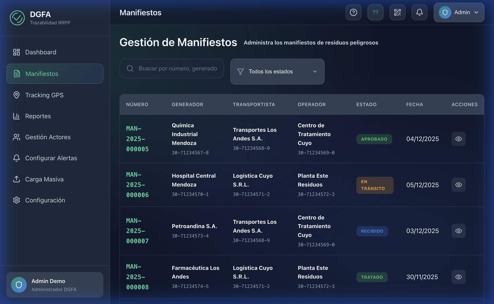

**Funcionalidades:**
- Filtrar por estado (Pendiente, En Tránsito, Completado)
- Buscar por número de manifiesto o empresa
- Ver detalle completo de cada manifiesto
- Exportar datos a Excel/PDF

**Casos de Uso Relacionados:**
- CU-A02: Gestionar Manifiestos
- CU-A03: Supervisar Estado de Manifiestos
- CU-A12: Exportar Datos

---

### 3.3 Tracking GPS en Tiempo Real

Monitoreo de todos los vehículos en ruta:

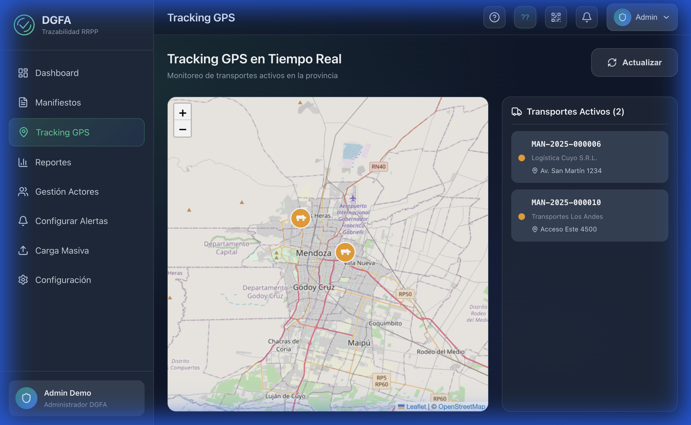

**Características:**
- Mapa interactivo con posición en tiempo real
- Rutas planificadas vs. rutas reales
- Historial de recorridos
- Alertas de geofencing ante desviaciones

**Casos de Uso Relacionados:**
- CU-A04: Monitorear Transporte en Tiempo Real
- CU-S03: Detectar Desviaciones de Ruta
- CU-S04: Enviar Alertas por Desviación

---

### 3.4 Gestión de Actores

Administre empresas, usuarios y permisos:

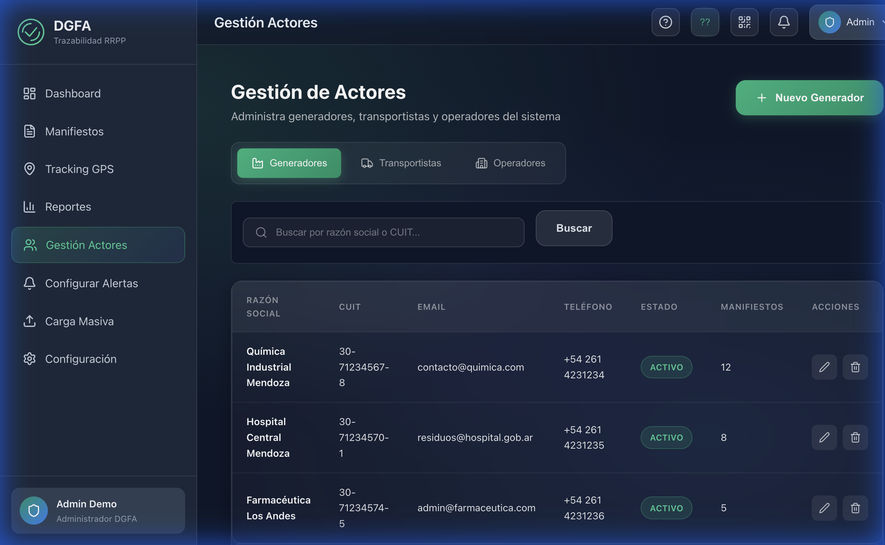

**Opciones Disponibles:**
- Alta/Baja/Modificación de empresas
- Gestión de usuarios por empresa
- Asignación de roles y permisos
- Historial de actividad por usuario

**Casos de Uso Relacionados:**
- CU-A05: Gestionar Generadores
- CU-A06: Gestionar Transportistas
- CU-A07: Gestionar Operadores
- CU-A08: Gestionar Vehículos
- CU-A09: Gestionar Usuarios

---

### 3.5 Reportes y Estadísticas

Generación de informes para fiscalización:

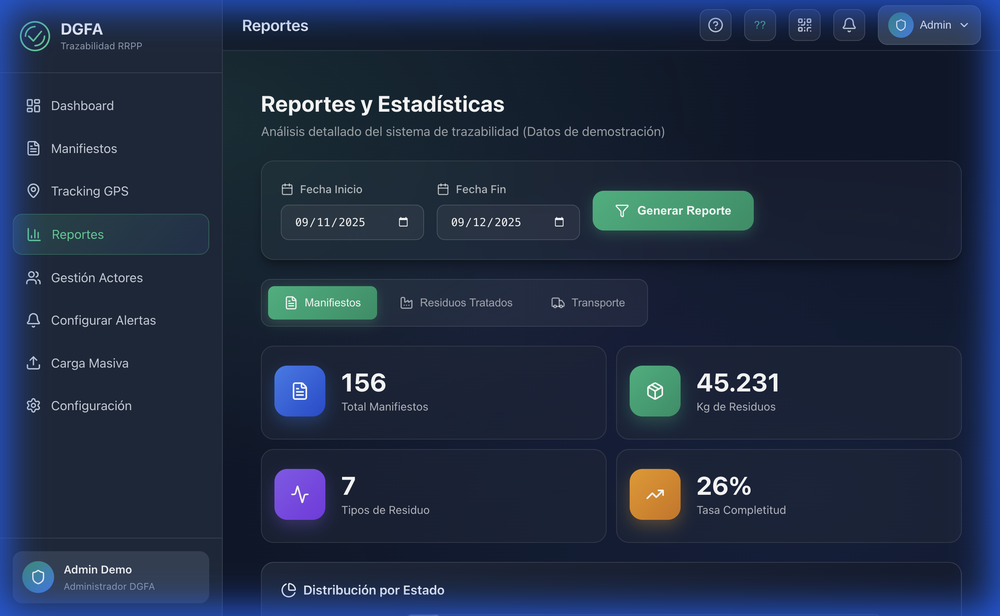

**Tipos de Reportes:**
- Reportes de trazabilidad por período
- Estadísticas por tipo de residuo
- Informes de cumplimiento normativo
- Exportación a formatos oficiales

**Casos de Uso Relacionados:**
- CU-A10: Generar Reportes
- CU-A11: Consultar Histórico
- CU-A12: Exportar Datos

---

## 4. Rol GENERADOR

El Generador es la empresa que produce residuos peligrosos y debe declararlos.

### 4.1 Dashboard del Generador

Vista principal con acceso rápido a funciones:

**Acciones Rápidas:**
- **Nuevo Manifiesto:** Crear declaración de residuos
- **Historial:** Ver manifiestos anteriores
- **Estado:** Monitorear manifiestos activos

---

### 4.2 Crear Nuevo Manifiesto

Proceso de declaración de residuos:

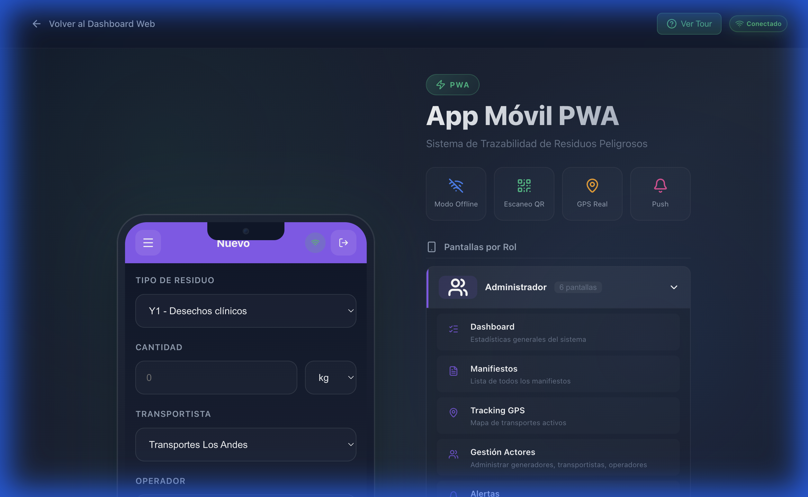

**Pasos para crear un manifiesto:**

1. **Seleccionar tipo de residuo** (código Y según Ley 24.051)
2. **Indicar cantidad** en kg, litros o unidades
3. **Describir características** del residuo
4. **Seleccionar transportista** habilitado
5. **Seleccionar planta destino** (operador)
6. **Confirmar y firmar** digitalmente

**Casos de Uso Relacionados:**
- CU-G01: Solicitar Retiro de Residuos
- CU-G03: Crear Manifiesto

---

### 4.3 Historial y Seguimiento

Consultar manifiestos generados:

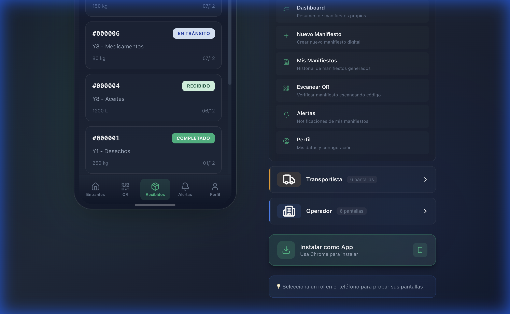

**Información Disponible:**
- Lista de todos los manifiestos
- Estado actual de cada manifiesto
- Documentación adjunta
- Certificados de tratamiento

**Casos de Uso Relacionados:**
- CU-G04: Verificar Estado
- CU-G05: Descargar Certificado
- CU-G02: Consultar Estado del Manifiesto

---

## 5. Rol TRANSPORTISTA

El Transportista es responsable del traslado de residuos peligrosos.

### 5.1 Dashboard del Transportista

Vista principal con viajes asignados:

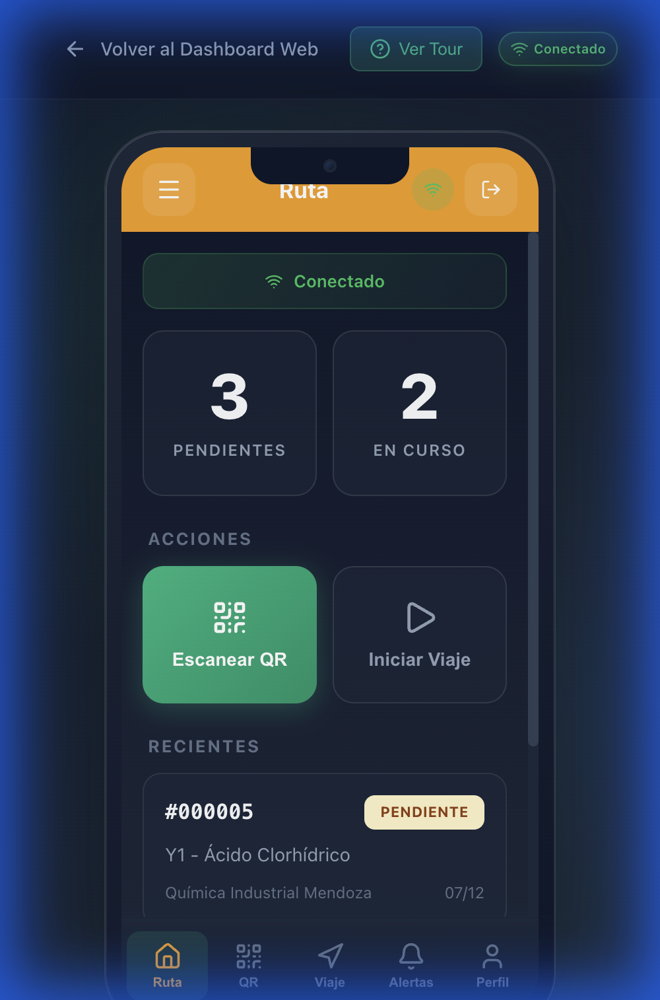

**Elementos del Dashboard:**
- Viajes pendientes de inicio
- Viajes en curso
- Historial de viajes completados

---

### 5.2 Escanear QR del Manifiesto

Validación del manifiesto al retirar residuos:

**Proceso:**

1. Abra la cámara con el botón **"Escanear QR"**
2. Apunte al código QR del manifiesto
3. Verifique que los datos coincidan
4. Confirme el retiro con su firma

**Casos de Uso Relacionados:**
- CU-T01: Ver Manifiestos Asignados
- CU-T02: Escanear QR del Manifiesto
- CU-T03: Confirmar Retiro de Residuos

---

### 5.3 Iniciar y Gestionar Viaje

Control del transporte en tiempo real:

**Funcionalidades:**
- Iniciar viaje con GPS activado
- Ver ruta optimizada al destino
- Registrar paradas o incidentes
- Finalizar viaje al llegar

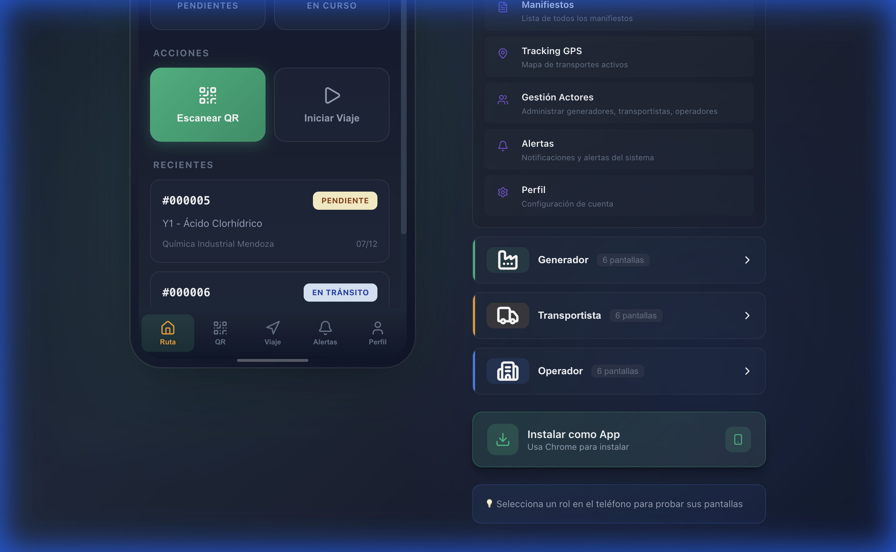

**Casos de Uso Relacionados:**
- CU-T04: Iniciar Viaje
- CU-T05: Registrar Incidentes
- CU-T06: Finalizar Viaje
- CU-T07: Actualizar Posición GPS

---

### 5.4 Manifiestos Asignados

Lista de manifiestos para transporte:

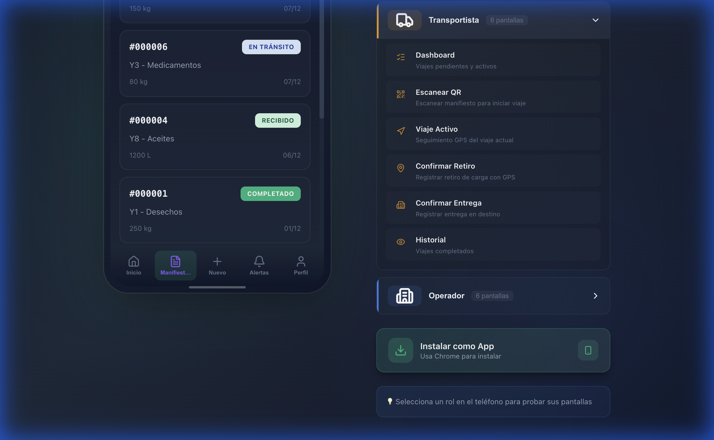

**Estados de Manifiestos:**
- 🟡 **Pendiente:** Esperando retiro
- 🔵 **En Tránsito:** Viaje en curso
- 🟢 **Entregado:** Recepcionado en planta

---

## 6. Rol OPERADOR

El Operador gestiona la planta de tratamiento o disposición final.

### 6.1 Dashboard del Operador

Pantalla principal con manifiestos entrantes y acciones disponibles:

**Funcionalidades:**
- Ver manifiestos entrantes en tiempo real
- Pestañas: Entrantes, Recibidos, Tratados
- Escanear QR para búsqueda rápida
- Control de estado de cada manifiesto

---

### 6.2 Manifiestos Entrantes

Lista de residuos próximos a llegar:

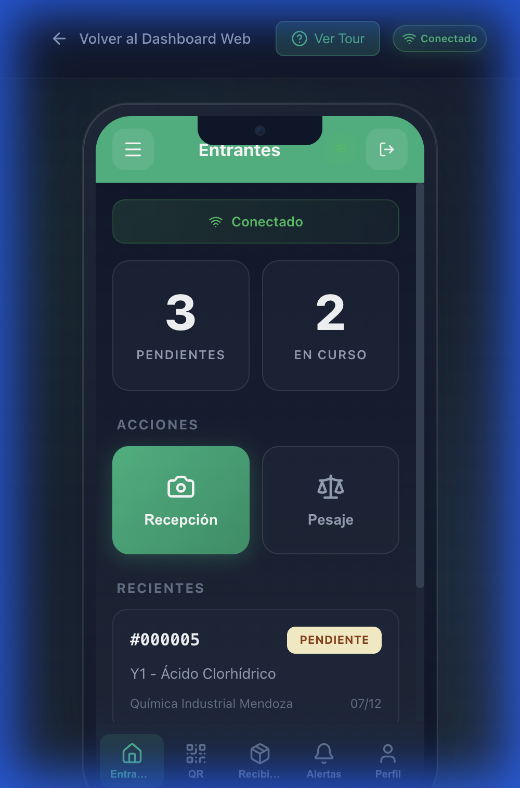

**Información mostrada:**
- Número de manifiesto
- Generador y transportista
- Tipo de residuo con código Y
- Cantidad declarada y ETA estimado

---

### 6.3 Recepción en Garita

Proceso de recepción de vehículos:

**Pasos:**

1. **Escanear QR** del manifiesto
2. **Verificar documentación** del transportista
3. **Confirmar ingreso** a la planta
4. **Asignar báscula** para pesaje

**Casos de Uso Relacionados:**
- CU-O01: Recibir Vehículo en Garita
- CU-O02: Escanear QR del Manifiesto
- CU-O03: Verificar Documentación

---

### 6.4 Escaneo QR del Operador

Búsqueda y validación de manifiestos por código QR:

**Funcionalidades:**
- Cámara integrada para escaneo
- Validación automática del manifiesto
- Información instantánea del residuo

---

### 6.5 Control de Pesaje

Registro del peso de residuos:

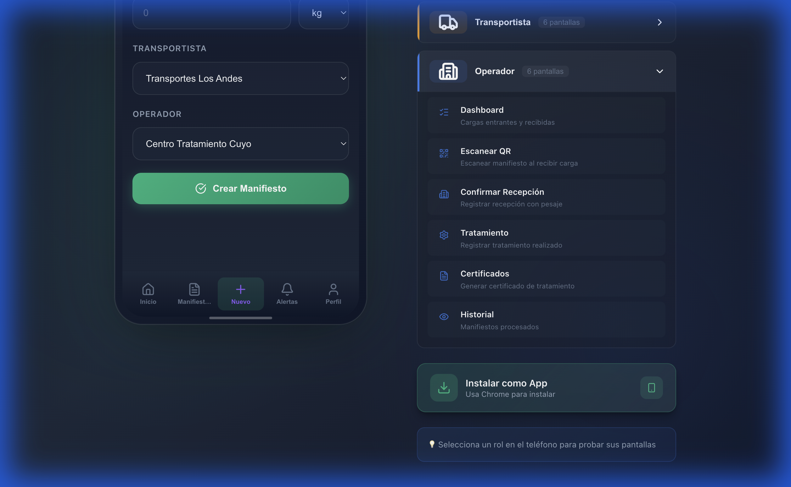

**Proceso de Pesaje:**

1. El vehículo ingresa a la báscula
2. Registrar peso bruto
3. El vehículo descarga los residuos
4. Registrar peso tara
5. El sistema calcula peso neto

**Casos de Uso Relacionados:**
- CU-O04: Registrar Pesaje
- CU-O05: Confirmar Recepción Final
- CU-O07: Registrar Diferencia de Peso

---

### 6.4 Tratamiento y Disposición

Registro del tratamiento aplicado:

**Proceso:**

1. Clasificar residuos recibidos
2. Aplicar tratamiento según tipo
3. Registrar método de disposición
4. Generar certificado de tratamiento

**Casos de Uso Relacionados:**
- CU-O06: Registrar Tratamiento
- CU-O08: Emitir Certificado de Tratamiento
- CU-O09: Actualizar Estado del Manifiesto

---

## 7. Aplicación Móvil (PWA)

### 7.1 Instalación

La aplicación móvil funciona como una Progressive Web App (PWA):

**Ventajas de la PWA:**
- ✅ No requiere descarga desde tienda
- ✅ Funciona offline
- ✅ Actualizaciones automáticas
- ✅ Ocupa poco espacio

---

### 7.2 Funcionalidades Offline

El sistema permite trabajar sin conexión:

- Los datos se sincronizan automáticamente
- Las acciones se encolan localmente
- Indicador de estado de conexión visible

---

### 7.3 Notificaciones Push

Reciba alertas en tiempo real:

- Nuevos manifiestos asignados
- Alertas de desviación de ruta
- Recordatorios de acciones pendientes
- Confirmaciones de procesos

---

## 8. Casos de Uso por Rol

### 8.1 Administrador (CU-A)

| ID | Caso de Uso | Descripción |
|----|-------------|-------------|
| CU-A01 | Visualizar Dashboard | Ver KPIs y estadísticas generales |
| CU-A02 | Gestionar Manifiestos | CRUD completo de manifiestos |
| CU-A03 | Supervisar Estado | Monitorear manifiestos activos |
| CU-A04 | Monitorear Transporte | Tracking GPS en tiempo real |
| CU-A05 | Gestionar Generadores | Alta/baja de empresas generadoras |
| CU-A06 | Gestionar Transportistas | Alta/baja de transportistas |
| CU-A07 | Gestionar Operadores | Alta/baja de plantas |
| CU-A08 | Gestionar Vehículos | Registro de flota |
| CU-A09 | Gestionar Usuarios | Control de accesos |
| CU-A10 | Generar Reportes | Informes de fiscalización |
| CU-A11 | Consultar Histórico | Búsqueda en archivo |
| CU-A12 | Exportar Datos | Descarga en Excel/PDF |
| CU-A13 | Monitorear Indicadores | KPIs ambientales |
| CU-A14 | Configurar Sistema | Parámetros generales |

---

### 8.2 Generador (CU-G)

| ID | Caso de Uso | Descripción |
|----|-------------|-------------|
| CU-G01 | Solicitar Retiro | Programar retiro de residuos |
| CU-G02 | Consultar Estado | Ver estado de manifiestos |
| CU-G03 | Crear Manifiesto | Declarar residuos |
| CU-G04 | Verificar Estado | Seguimiento en tiempo real |
| CU-G05 | Descargar Certificado | Obtener certificado de tratamiento |
| CU-G06 | Firmar Manifiesto | Firma digital |
| CU-G07 | Cancelar Manifiesto | Anular manifiesto pendiente |
| CU-G08 | Ver Historial | Consultar manifiestos anteriores |
| CU-G09 | Recibir Notificaciones | Alertas del sistema |
| CU-G10 | Generar Reportes | Informes propios |
| CU-G11 | Consultar Transportistas | Ver transportistas habilitados |
| CU-G12 | Actualizar Perfil | Modificar datos de empresa |

---

### 8.3 Transportista (CU-T)

| ID | Caso de Uso | Descripción |
|----|-------------|-------------|
| CU-T01 | Ver Manifiestos | Lista de manifiestos asignados |
| CU-T02 | Escanear QR | Validar manifiesto |
| CU-T03 | Confirmar Retiro | Registrar recogida |
| CU-T04 | Iniciar Viaje | Comenzar transporte con GPS |
| CU-T05 | Registrar Incidentes | Documentar problemas |
| CU-T06 | Finalizar Viaje | Confirmar llegada |
| CU-T07 | Actualizar GPS | Envío de posición |
| CU-T08 | Ver Ruta | Navegación optimizada |
| CU-T09 | Firmar Entrega | Firma digital en destino |
| CU-T10 | Ver Historial | Viajes completados |
| CU-T11 | Recibir Alertas | Notificaciones push |
| CU-T12 | Actualizar Perfil | Datos de conductor |

---

### 8.4 Operador (CU-O)

| ID | Caso de Uso | Descripción |
|----|-------------|-------------|
| CU-O01 | Recibir Vehículo | Ingreso en garita |
| CU-O02 | Escanear QR | Validar manifiesto |
| CU-O03 | Verificar Documentación | Control de papeles |
| CU-O04 | Registrar Pesaje | Báscula de ingreso |
| CU-O05 | Confirmar Recepción | Aceptar carga |
| CU-O06 | Registrar Tratamiento | Proceso aplicado |
| CU-O07 | Registrar Diferencia | Variación de peso |
| CU-O08 | Emitir Certificado | Certificado de tratamiento |
| CU-O09 | Actualizar Estado | Cambio de estado del manifiesto |
| CU-O10 | Rechazar Carga | Devolver carga no conforme |
| CU-O11 | Ver Historial | Recepciones anteriores |
| CU-O12 | Generar Reportes | Informes de planta |

---

## 9. Preguntas Frecuentes

### ¿Cómo recupero mi contraseña?
Contacte al administrador del sistema para restablecer su contraseña.

### ¿Qué hago si el GPS no funciona?
Verifique que la aplicación tenga permisos de ubicación. En iOS, vaya a Configuración > Privacidad > Servicios de ubicación.

### ¿Puedo trabajar sin conexión a Internet?
Sí, la aplicación almacena datos localmente y sincroniza cuando recupera conexión.

### ¿Cómo instalo la app en mi celular?
Siga las instrucciones en la sección 7.1 de este manual.

### ¿Qué navegadores son compatibles?
Chrome, Firefox, Safari y Edge en sus versiones más recientes.

---

## Soporte Técnico

**Email:** soporte@demoambiente.ultimamilla.com.ar  
**Teléfono:** +54 261 XXX-XXXX  
**Horario:** Lunes a Viernes, 8:00 a 18:00

---

*Documento generado automáticamente - Versión 1.0*  
*Fecha: Diciembre 2024*  
*Sistema de Trazabilidad de Residuos Peligrosos - DGFA Mendoza*
