# MANUAL TUTORIAL - Sistema de Trazabilidad de Residuos Peligrosos

## Dirección de Gestión y Fiscalización Ambiental - Gobierno de Mendoza

---

## 1. INTRODUCCIÓN

### 1.1 Visión General del Sistema

El Sistema de Trazabilidad de Residuos Peligrosos (RRPP) es una plataforma integral diseñada para la gestión completa del ciclo de vida de los manifiestos de residuos peligrosos en la Provincia de Mendoza, conforme a la Ley Nacional 24.051.

El sistema cuenta con **dos modalidades de acceso**:

| Modalidad | Descripción | Acceso |
|-----------|-------------|--------|
| **Dashboard Web** | Interfaz de escritorio completa para gestión administrativa | `/dashboard` |
| **Demo App (PWA)** | Aplicación móvil para operaciones en campo | `/demo-app` |

### 1.2 Actores del Sistema

| Actor | Descripción | Casos de Uso |
|-------|-------------|--------------|
| **Administrador DGFA** | Supervisa y administra el sistema completo | CU-A01 a CU-A15 |
| **Generador** | Empresa que produce residuos peligrosos | CU-G01 a CU-G12 |
| **Transportista** | Empresa habilitada para transporte | CU-T01 a CU-T11 |
| **Operador** | Planta de tratamiento/disposición final | CU-O01 a CU-O12 |

### 1.3 Acceso al Sistema

**Contraseña de Demo:** `mimi88`

- El Dashboard Web requiere esta contraseña para acceder
- La Demo App (selector de roles) tiene acceso libre

---

## 2. VERSIÓN DASHBOARD (Escritorio)

### 2.1 Cambio de Perfil en el Menú

> **IMPORTANTE**: El sistema permite cambiar de rol desde el menú lateral de navegación.

El menú desplegable de navegación muestra todas las opciones disponibles según el rol actual. Para cambiar de perfil:

1. Acceder al Dashboard con la contraseña `mimi88`
2. En el menú lateral izquierdo, observar la sección de usuario
3. Hacer clic en el selector de rol para cambiar entre perfiles

Los roles disponibles son:
- **Administrador** - Acceso completo al sistema
- **Generador** - Creación y seguimiento de manifiestos
- **Transportista** - Gestión de viajes y GPS
- **Operador** - Recepción y tratamiento

---

### 2.2 Administrador DGFA

#### 2.2.1 Dashboard Ejecutivo (CU-A02)

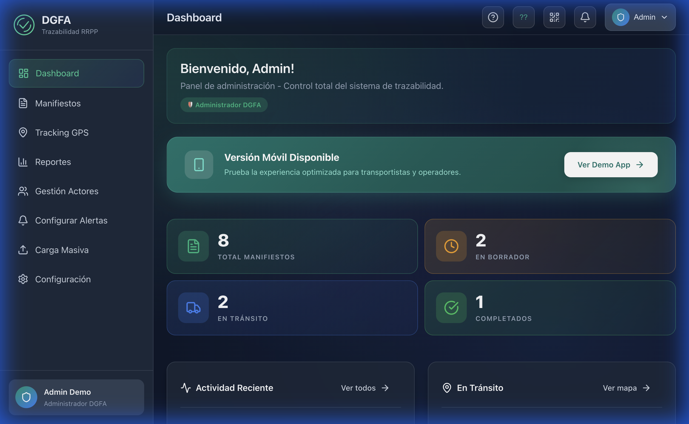

El dashboard presenta:
- **Métricas en tiempo real**: Manifiestos activos, en tránsito, completados
- **Mapa interactivo**: Ubicación GPS de transportes activos
- **Alertas pendientes**: Notificaciones que requieren atención
- **Gráficos de tendencias**: Estadísticas de los últimos 30 días

**Acciones disponibles:**
- Filtrar por período, tipo de residuo o actor
- Exportar datos en PDF/CSV
- Acceder a cualquier manifiesto con un clic

#### 2.2.2 Gestión de Manifiestos (CU-A09)

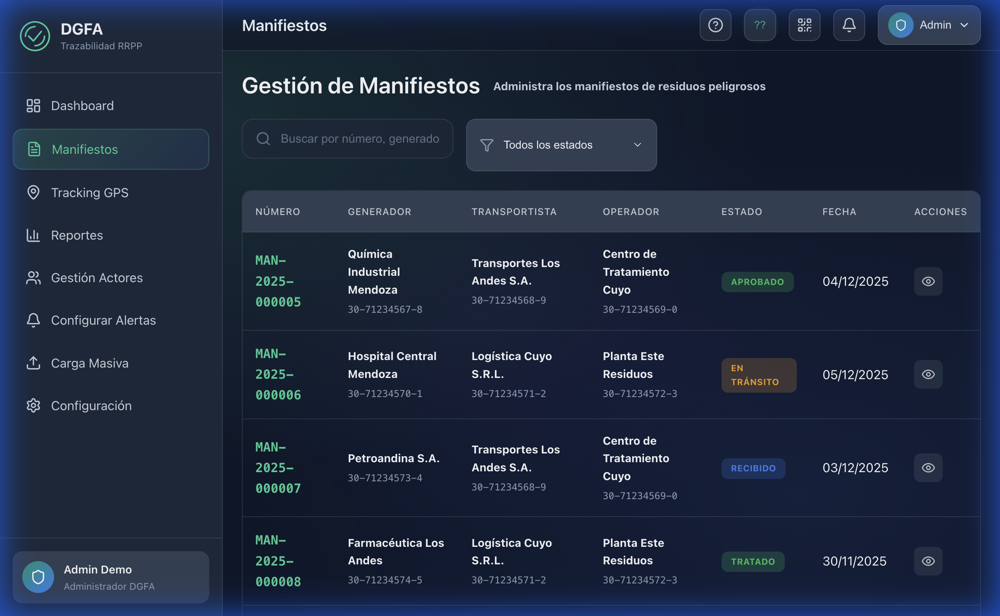

Funcionalidades:
- Listado completo de todos los manifiestos del sistema
- Filtros avanzados por estado, fecha, generador, transportista
- Visualización del estado actual de cada manifiesto
- Acceso al detalle con timeline completo de eventos

**Estados de Manifiestos:**
| Estado | Color | Descripción |
|--------|-------|-------------|
| Borrador | Gris | En edición, no firmado |
| Pendiente | Amarillo | Firmado, esperando retiro |
| En Tránsito | Azul | En transporte con GPS |
| Recibido | Verde | Llegó a destino |
| Tratado | Verde oscuro | Proceso completado |

#### 2.2.3 Monitoreo GPS en Tiempo Real (CU-A09)

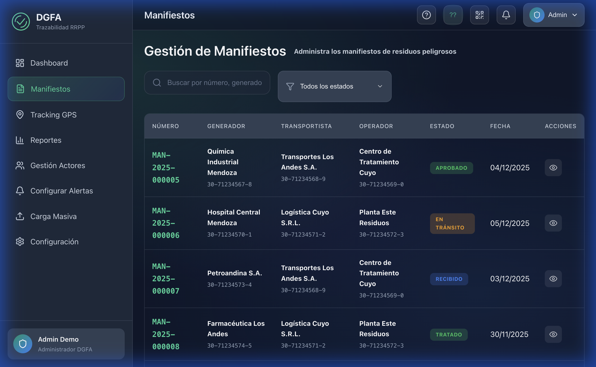

El mapa de monitoreo muestra:
- Posición en tiempo real de cada transporte
- Ruta esperada vs ruta actual
- ETA (tiempo estimado de llegada)
- Alertas de desvío automáticas

**Actualización automática cada 30 segundos**

#### 2.2.4 Gestión de Actores (CU-A03 a CU-A08)

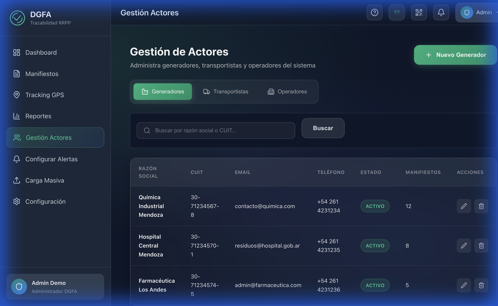

Permite administrar:
- **Generadores** (CU-A06): Alta, baja y modificación de empresas generadoras
- **Transportistas** (CU-A07): Registro de empresas, vehículos y choferes
- **Operadores** (CU-A08): Plantas de tratamiento habilitadas

Cada actor incluye:
- Datos de la empresa (razón social, CUIT)
- Número de habilitación
- Estado activo/inactivo
- Historial de manifiestos

#### 2.2.5 Reportes y Estadísticas (CU-A10 a CU-A12)

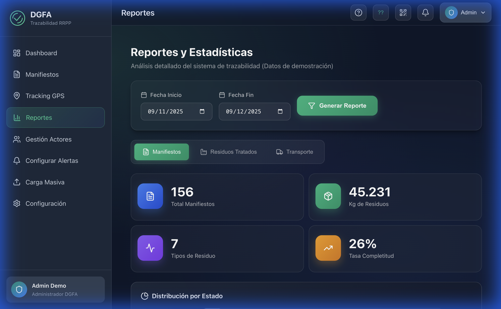

Tipos de reportes disponibles:
- **Por período**: Manifiestos por día/semana/mes
- **Por tipo de residuo**: Según categorías Y de Ley 24.051
- **Por actor**: Generadores, transportistas, operadores
- **Por zona geográfica**: Distribución territorial

**Formatos de exportación:** PDF, CSV, XML

#### 2.2.6 Configuración de Alertas (CU-A13)

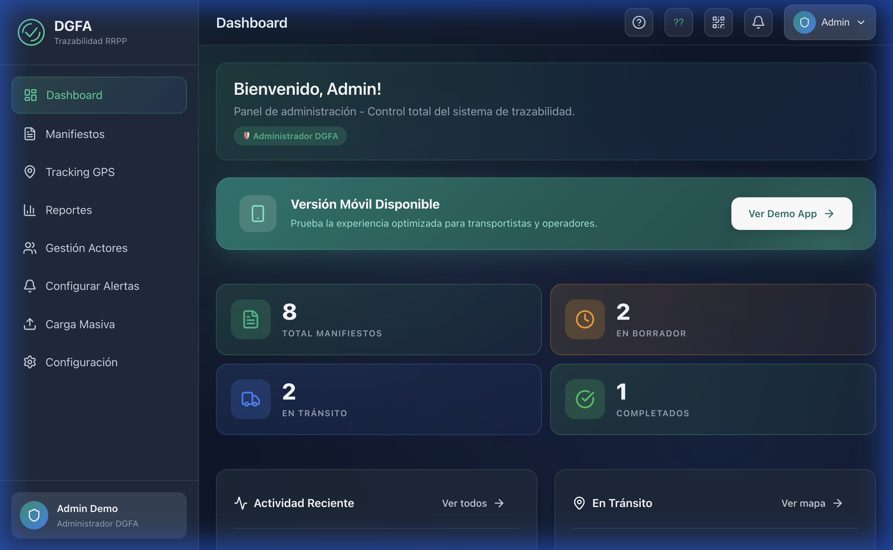

Reglas configurables:
- Vencimientos de manifiestos
- Desvíos de ruta (GPS)
- Tiempos excesivos de transporte
- Diferencias de pesaje
- Rechazos de carga

---

### 2.3 Generador de Residuos

#### 2.3.1 Dashboard del Generador (CU-G02)

El generador visualiza:
- Manifiestos en borrador
- Pendientes de retiro
- En tránsito
- Completados

**Accesos directos:**
- Crear nuevo manifiesto
- Consultar historial
- Ver alertas

#### 2.3.2 Crear Manifiesto Electrónico (CU-G03 a CU-G07)

Flujo de creación:

1. **Seleccionar tipo de residuo** (CU-G04)
   - Catálogo según Ley 24.051
   - Categorías Y con características

2. **Ingresar cantidad y unidad**
   - Kilogramos o litros
   - Descripción adicional

3. **Asignar transportista** (CU-G05)
   - Lista de transportistas habilitados
   - Verificación de habilitación vigente

4. **Seleccionar operador destino** (CU-G06)
   - Operadores compatibles con el residuo
   - Verificación de capacidad

5. **Firmar manifiesto** (CU-G07)
   - Firma electrónica con token
   - Generación de QR único

#### 2.3.3 Consulta de Estado (CU-G08)

Para cada manifiesto se puede ver:
- Estado actual
- Ubicación GPS (si está en tránsito)
- Timeline de eventos
- Datos completos del manifiesto

#### 2.3.4 Historial y PDF (CU-G09, CU-G10)

- Listado paginado con filtros
- Exportación a PDF con QR
- Descarga de certificados

---

### 2.4 Transportista

#### 2.4.1 Dashboard de Viajes (CU-T02)

Muestra:
- Manifiestos asignados pendientes de retiro
- Viajes activos en curso
- Historial de viajes completados

#### 2.4.2 Gestión de Viajes

Proceso de un viaje:

1. **Confirmar retiro** (CU-T03)
   - Escaneo de QR
   - Captura GPS del punto
   - Firma del generador

2. **Iniciar transporte** (CU-T04)
   - Activación de tracking GPS
   - Notificación a partes

3. **Actualizar estado** (CU-T05)
   - Registrar paradas
   - Reportar demoras

4. **Confirmar entrega** (CU-T07)
   - Verificación GPS en destino
   - Firma de entrega

#### 2.4.3 Modo Offline (CU-T09)

El sistema soporta operación sin conexión:
- Todas las operaciones se guardan localmente
- Sincronización automática al recuperar señal
- Base de datos local cifrada

---

### 2.5 Operador

#### 2.5.1 Manifiestos Entrantes (CU-O02)

Lista de manifiestos con destino a la planta:
- ETA estimado
- Datos del generador y transportista
- Tipo de residuo

#### 2.5.2 Recepción y Pesaje (CU-O03, CU-O04)

Proceso de recepción:

1. **Escanear QR** del manifiesto
2. **Verificar datos** del residuo
3. **Registrar peso** real en báscula
4. **Comparar** con cantidad declarada
5. **Firmar recepción** conforme

#### 2.5.3 Tratamiento y Certificados (CU-O08 a CU-O10)

1. **Registrar tratamiento** aplicado
2. **Seleccionar método** del catálogo
3. **Cerrar manifiesto** con firma
4. **Generar certificado** de disposición

---

## 3. DEMO APP (PWA Móvil)

### 3.1 Selector de Roles

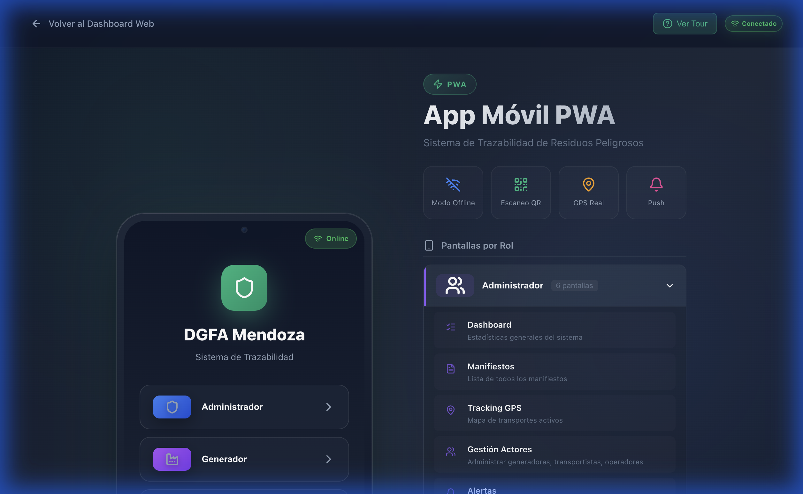

Al acceder a `/demo-app`, se presenta el selector de roles:
- **Administrador** - Icono escudo azul
- **Generador** - Icono fábrica púrpura
- **Transportista** - Icono camión naranja
- **Operador** - Icono edificio verde

El **onboarding** se muestra automáticamente con un tour de funcionalidades.

---

### 3.2 Administrador (Móvil)

Funciones disponibles:
- Dashboard con métricas
- Lista de manifiestos
- Mapa de tracking
- Gestión de actores

---

### 3.3 Generador (Móvil)

#### Dashboard del Generador

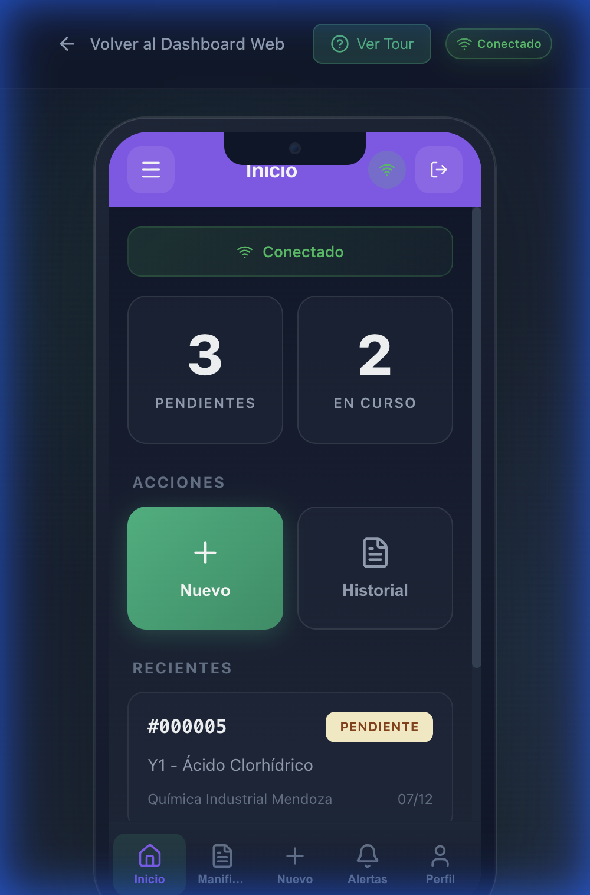

Muestra:
- Contadores de manifiestos por estado
- Acceso rápido a crear nuevo
- Últimos manifiestos

#### Crear Manifiesto

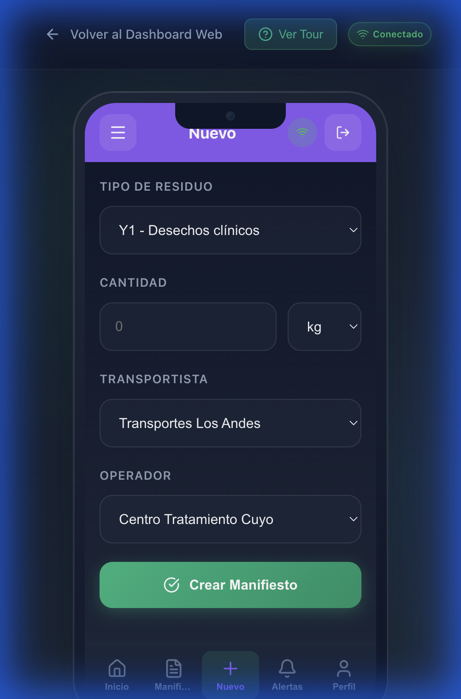

Formulario simplificado para móvil:
- Selector de tipo de residuo
- Ingreso de cantidad
- Selección de transportista
- Selección de operador

#### Historial

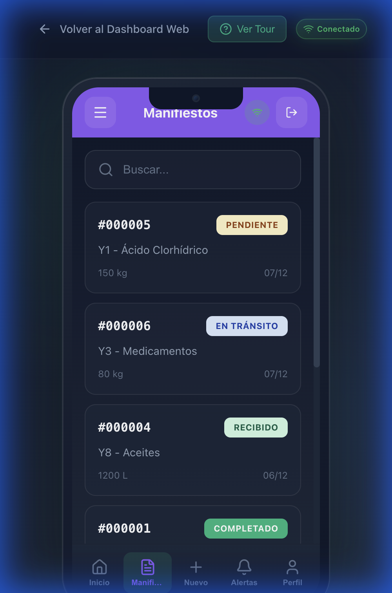

Lista de manifiestos con búsqueda y filtros.

---

### 3.4 Transportista (Móvil)

#### Dashboard de Ruta

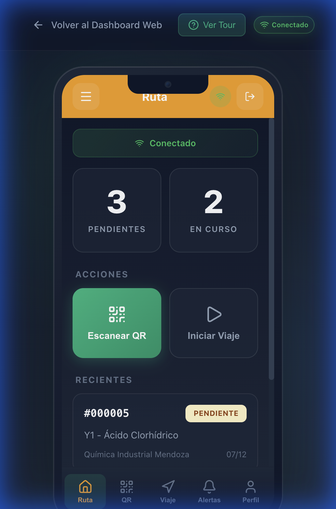

Panel principal con:
- Manifiestos asignados
- Viaje activo (si existe)
- Acciones rápidas

#### Escaneo QR (CU-T08)

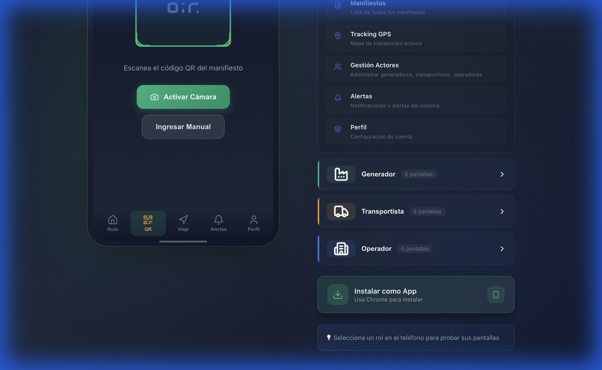

Permite:
- Escanear QR del manifiesto
- Cargar datos automáticamente
- Verificar información

#### Viaje Activo

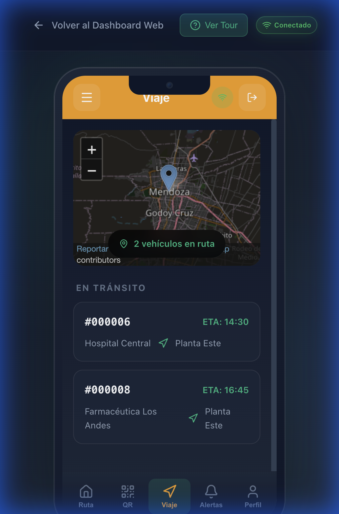

Durante el viaje:
- Temporizador de duración
- Ubicación GPS actual
- Botones de incidente y parada
- Confirmar entrega

#### Detalle de Manifiesto

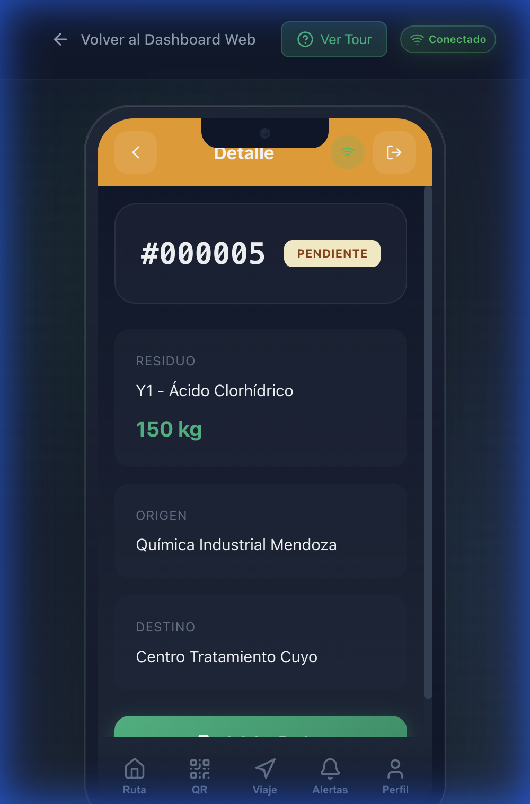

Información completa del manifiesto con acciones disponibles.

---

### 3.5 Operador (Móvil)

#### Dashboard Entrantes

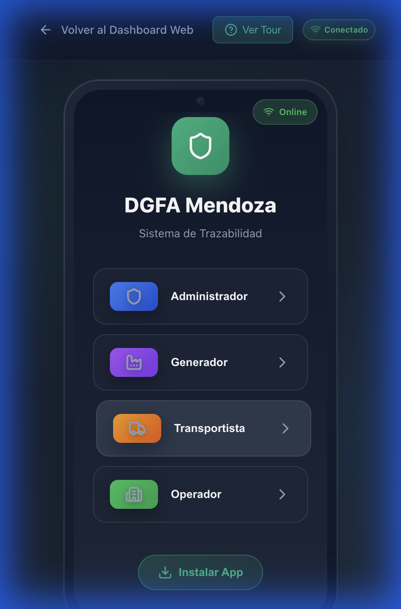

Vista de:
- Cargas entrantes con ETA
- Acciones de recepción
- Pesaje pendiente

#### Escaneo QR

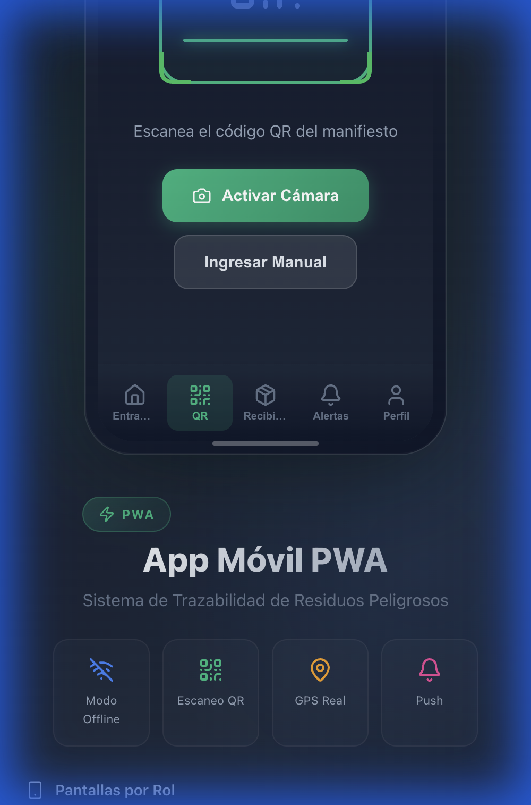

Para recepción:
- Escanear QR del manifiesto entrante
- Validar datos offline si es necesario
- Iniciar proceso de recepción

#### Recepción

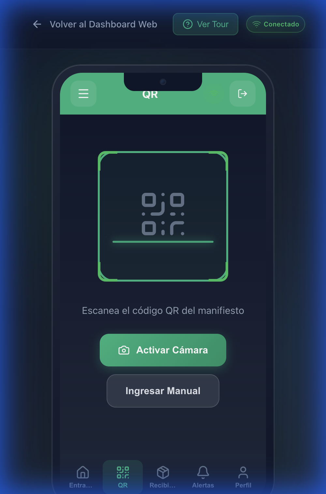

Confirmar:
- Datos del residuo
- Peso registrado
- Observaciones

---

## 4. CARACTERÍSTICAS TÉCNICAS

### 4.1 PWA - Instalable como App

La aplicación puede instalarse en dispositivos móviles:
- **Android**: Menú ⋮ → "Instalar aplicación"
- **iOS**: Compartir → "Agregar a pantalla de inicio"

### 4.2 Modo Offline (CU-T09)

- Funcionamiento completo sin conexión
- Sincronización automática
- Base de datos local cifrada

### 4.3 Notificaciones Push (CU-G11)

Alertas automáticas por:
- Cambios de estado
- Retiros y entregas
- Anomalías detectadas

### 4.4 Seguridad

- Autenticación con token 2FA
- Firma electrónica de documentos
- Log de auditoría completo (CU-A10)
- Cifrado de datos sensibles

---

## 5. ANEXOS

### 5.1 Referencia de Casos de Uso

| Módulo | Casos de Uso |
|--------|--------------|
| Autenticación | CU-A01, CU-G01, CU-T01, CU-O01 |
| Dashboard | CU-A02, CU-G02, CU-T02, CU-O02 |
| Manifiestos | CU-A09, CU-G03-G10, CU-T02-T08, CU-O02-O09 |
| Gestión Actores | CU-A03-A08, CU-G12, CU-T11 |
| Reportes | CU-A10-A12, CU-G09, CU-T10, CU-O11-O12 |
| Configuración | CU-A13-A15, CU-T09 |

### 5.2 Contacto

**Dirección de Gestión y Fiscalización Ambiental**  
Gobierno de Mendoza

---

*Documento generado automáticamente - Diciembre 2025*
