# MANUAL TUTORIAL - Sistema de Trazabilidad de Residuos Peligrosos

## Dirección de Gestión y Fiscalización Ambiental - Gobierno de Mendoza

---

## 1. INTRODUCCIÓN

### 1.1 Visión General del Sistema

El Sistema de Trazabilidad de Residuos Peligrosos (RRPP) es una plataforma integral diseñada para la gestión completa del ciclo de vida de los manifiestos de residuos peligrosos en la Provincia de Mendoza, conforme a la Ley Nacional 24.051.

El sistema cuenta con **dos modalidades de acceso**:

| Modalidad | Descripción | Acceso |
|-----------|-------------|--------|
| **Dashboard Web** | Interfaz de escritorio completa para gestión administrativa | `/dashboard` |
| **Demo App (PWA)** | Aplicación móvil para operaciones en campo | `/demo-app` |

### 1.2 Actores del Sistema

| Actor | Descripción | Casos de Uso |
|-------|-------------|--------------|
| **Administrador SITREP** | Supervisa y administra el sistema completo | CU-A01 a CU-A15 |
| **Generador** | Empresa que produce residuos peligrosos | CU-G01 a CU-G12 |
| **Transportista** | Empresa habilitada para transporte | CU-T01 a CU-T11 |
| **Operador** | Planta de tratamiento/disposición final | CU-O01 a CU-O12 |

### 1.3 Acceso al Sistema

**Contraseña de Demo:** `mimi88`

- El Dashboard Web requiere esta contraseña para acceder
- La Demo App (selector de roles) tiene acceso libre

---

## 2. VERSIÓN DASHBOARD (Escritorio)

### 2.1 Cambio de Perfil en el Menú

> **IMPORTANTE**: El sistema permite cambiar de rol desde el menú lateral de navegación.

El menú desplegable de navegación muestra todas las opciones disponibles según el rol actual. Para cambiar de perfil:

1. Acceder al Dashboard con la contraseña `mimi88`
2. En el menú lateral izquierdo, observar la sección de usuario
3. Hacer clic en el selector de rol para cambiar entre perfiles

Los roles disponibles son:
- **Administrador** - Acceso completo al sistema
- **Generador** - Creación y seguimiento de manifiestos
- **Transportista** - Gestión de viajes y GPS
- **Operador** - Recepción y tratamiento

---

### 2.2 Administrador SITREP

#### 2.2.1 Dashboard Ejecutivo (CU-A02)

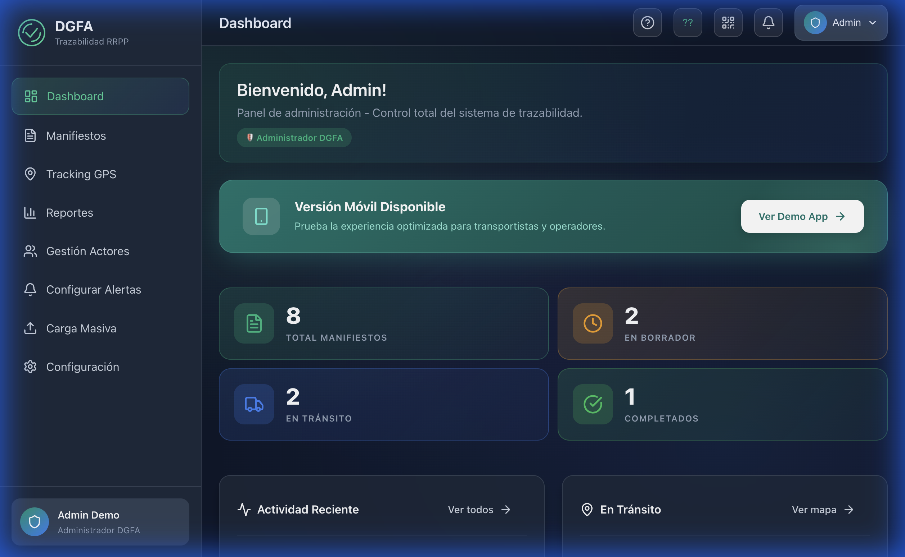

El dashboard presenta:
- **Métricas en tiempo real**: Manifiestos activos, en tránsito, completados
- **Mapa interactivo**: Ubicación GPS de transportes activos
- **Alertas pendientes**: Notificaciones que requieren atención
- **Gráficos de tendencias**: Estadísticas de los últimos 30 días

**Acciones disponibles:**
- Filtrar por período, tipo de residuo o actor
- Exportar datos en PDF/CSV
- Acceder a cualquier manifiesto con un clic

#### 2.2.2 Gestión de Manifiestos (CU-A09)

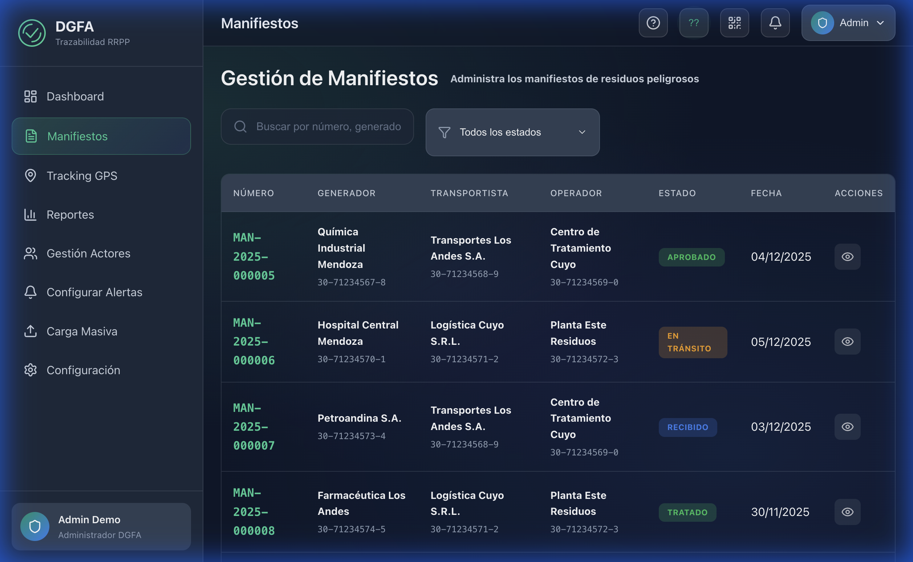

Funcionalidades:
- Listado completo de todos los manifiestos del sistema
- Filtros avanzados por estado, fecha, generador, transportista
- Visualización del estado actual de cada manifiesto
- Acceso al detalle con timeline completo de eventos

**Estados de Manifiestos:**
| Estado | Color | Descripción |
|--------|-------|-------------|
| Borrador | Gris | En edición, no firmado |
| Pendiente | Amarillo | Firmado, esperando retiro |
| En Tránsito | Azul | En transporte con GPS |
| Recibido | Verde | Llegó a destino |
| Tratado | Verde oscuro | Proceso completado |

#### 2.2.3 Monitoreo GPS en Tiempo Real (CU-A09)

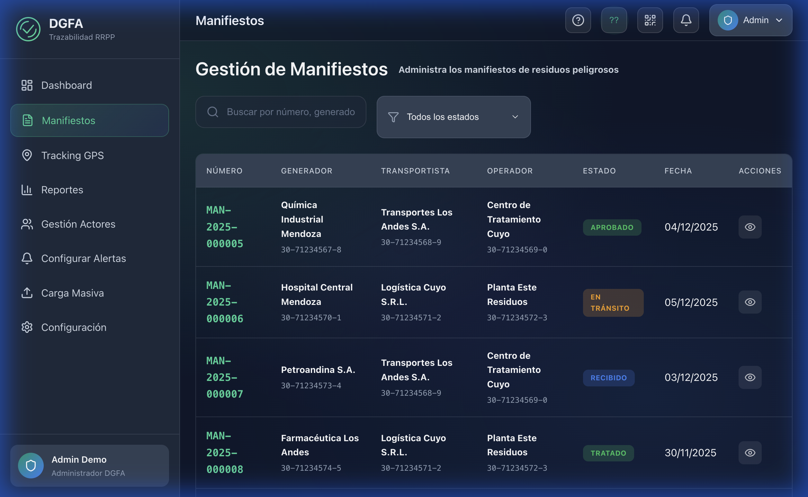

El mapa de monitoreo muestra:
- Posición en tiempo real de cada transporte
- Ruta esperada vs ruta actual
- ETA (tiempo estimado de llegada)
- Alertas de desvío automáticas

**Actualización automática cada 30 segundos**

#### 2.2.4 Gestión de Actores (CU-A03 a CU-A08)

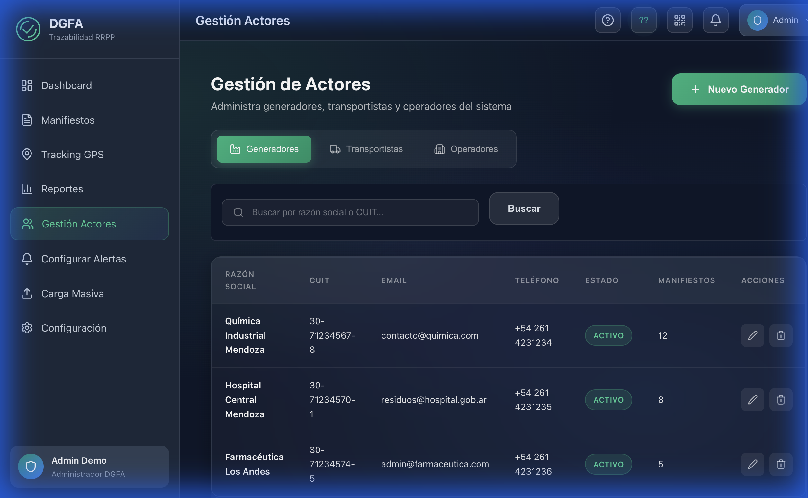

Permite administrar:
- **Generadores** (CU-A06): Alta, baja y modificación de empresas generadoras
- **Transportistas** (CU-A07): Registro de empresas, vehículos y choferes
- **Operadores** (CU-A08): Plantas de tratamiento habilitadas

Cada actor incluye:
- Datos de la empresa (razón social, CUIT)
- Número de habilitación
- Estado activo/inactivo
- Historial de manifiestos

#### 2.2.5 Reportes y Estadísticas (CU-A10 a CU-A12)

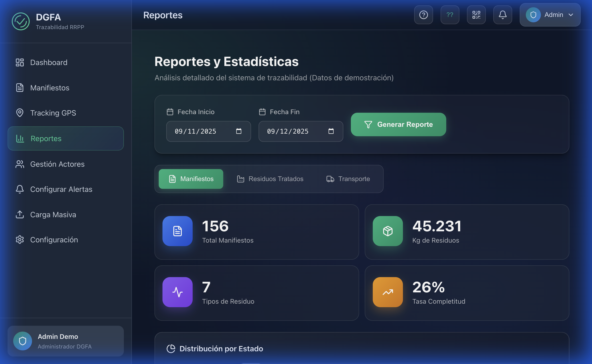

Tipos de reportes disponibles:
- **Por período**: Manifiestos por día/semana/mes
- **Por tipo de residuo**: Según categorías Y de Ley 24.051
- **Por actor**: Generadores, transportistas, operadores
- **Por zona geográfica**: Distribución territorial

**Formatos de exportación:** PDF, CSV, XML

#### 2.2.6 Configuración de Alertas (CU-A13)

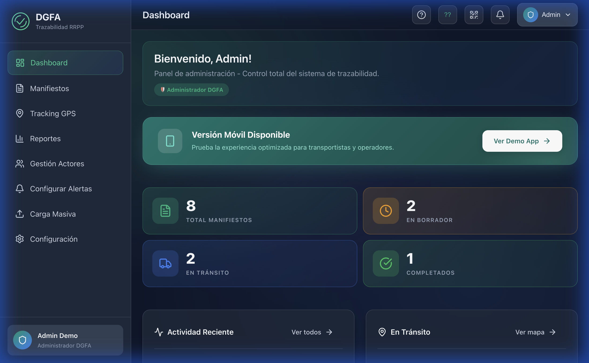

Reglas configurables:
- Vencimientos de manifiestos
- Desvíos de ruta (GPS)
- Tiempos excesivos de transporte
- Diferencias de pesaje
- Rechazos de carga

---

### 2.3 Generador de Residuos

#### 2.3.1 Dashboard del Generador (CU-G02)

El generador visualiza:
- Manifiestos en borrador
- Pendientes de retiro
- En tránsito
- Completados

**Accesos directos:**
- Crear nuevo manifiesto
- Consultar historial
- Ver alertas

#### 2.3.2 Crear Manifiesto Electrónico (CU-G03 a CU-G07)

Flujo de creación:

1. **Seleccionar tipo de residuo** (CU-G04)
   - Catálogo según Ley 24.051
   - Categorías Y con características

2. **Ingresar cantidad y unidad**
   - Kilogramos o litros
   - Descripción adicional

3. **Asignar transportista** (CU-G05)
   - Lista de transportistas habilitados
   - Verificación de habilitación vigente

4. **Seleccionar operador destino** (CU-G06)
   - Operadores compatibles con el residuo
   - Verificación de capacidad

5. **Firmar manifiesto** (CU-G07)
   - Firma electrónica con token
   - Generación de QR único

#### 2.3.3 Consulta de Estado (CU-G08)

Para cada manifiesto se puede ver:
- Estado actual
- Ubicación GPS (si está en tránsito)
- Timeline de eventos
- Datos completos del manifiesto

#### 2.3.4 Historial y PDF (CU-G09, CU-G10)

- Listado paginado con filtros
- Exportación a PDF con QR
- Descarga de certificados

---

### 2.4 Transportista

#### 2.4.1 Dashboard de Viajes (CU-T02)

Muestra:
- Manifiestos asignados pendientes de retiro
- Viajes activos en curso
- Historial de viajes completados

#### 2.4.2 Gestión de Viajes

Proceso de un viaje:

1. **Confirmar retiro** (CU-T03)
   - Escaneo de QR
   - Captura GPS del punto
   - Firma del generador

2. **Iniciar transporte** (CU-T04)
   - Activación de tracking GPS
   - Notificación a partes

3. **Actualizar estado** (CU-T05)
   - Registrar paradas
   - Reportar demoras

4. **Confirmar entrega** (CU-T07)
   - Verificación GPS en destino
   - Firma de entrega

#### 2.4.3 Modo Offline (CU-T09)

El sistema soporta operación sin conexión:
- Todas las operaciones se guardan localmente
- Sincronización automática al recuperar señal
- Base de datos local cifrada

---

### 2.5 Operador

#### 2.5.1 Manifiestos Entrantes (CU-O02)

Lista de manifiestos con destino a la planta:
- ETA estimado
- Datos del generador y transportista
- Tipo de residuo

#### 2.5.2 Recepción y Pesaje (CU-O03, CU-O04)

Proceso de recepción:

1. **Escanear QR** del manifiesto
2. **Verificar datos** del residuo
3. **Registrar peso** real en báscula
4. **Comparar** con cantidad declarada
5. **Firmar recepción** conforme

#### 2.5.3 Tratamiento y Certificados (CU-O08 a CU-O10)

1. **Registrar tratamiento** aplicado
2. **Seleccionar método** del catálogo
3. **Cerrar manifiesto** con firma
4. **Generar certificado** de disposición

---

## 3. DEMO APP (PWA Móvil)

### 3.1 Selector de Roles

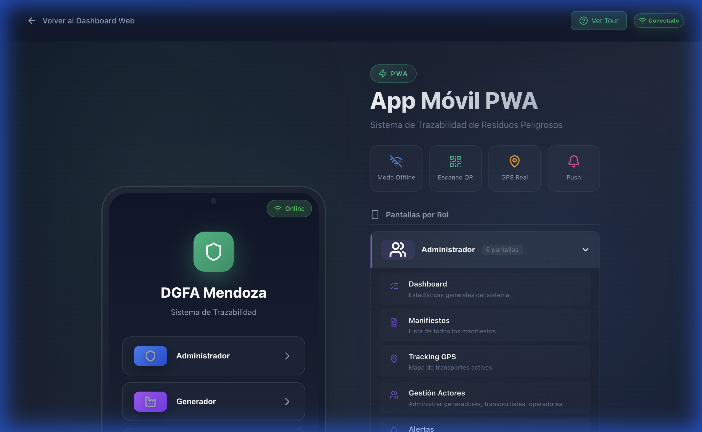

Al acceder a `/demo-app`, se presenta el selector de roles:
- **Administrador** - Icono escudo azul
- **Generador** - Icono fábrica púrpura
- **Transportista** - Icono camión naranja
- **Operador** - Icono edificio verde

El **onboarding** se muestra automáticamente con un tour de funcionalidades.

---

### 3.2 Administrador (Móvil)

Funciones disponibles:
- Dashboard con métricas
- Lista de manifiestos
- Mapa de tracking
- Gestión de actores

---

### 3.3 Generador (Móvil)

#### Dashboard del Generador

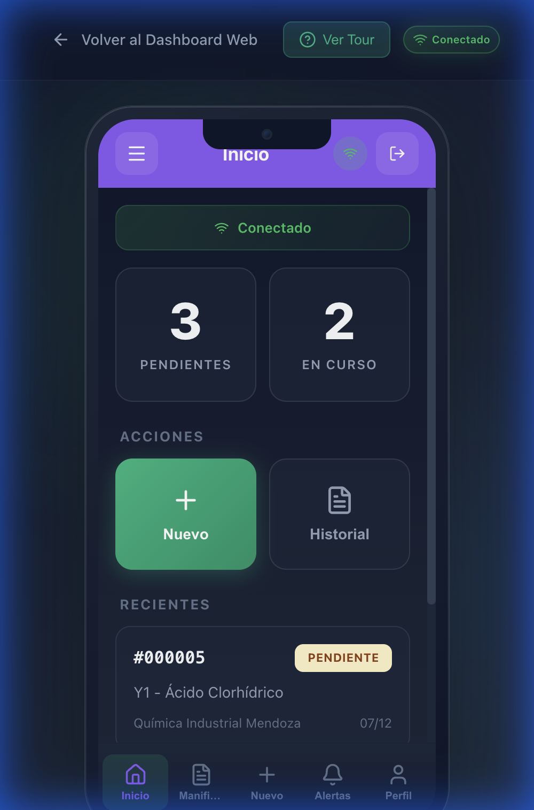

Muestra:
- Contadores de manifiestos por estado
- Acceso rápido a crear nuevo
- Últimos manifiestos

#### Crear Manifiesto

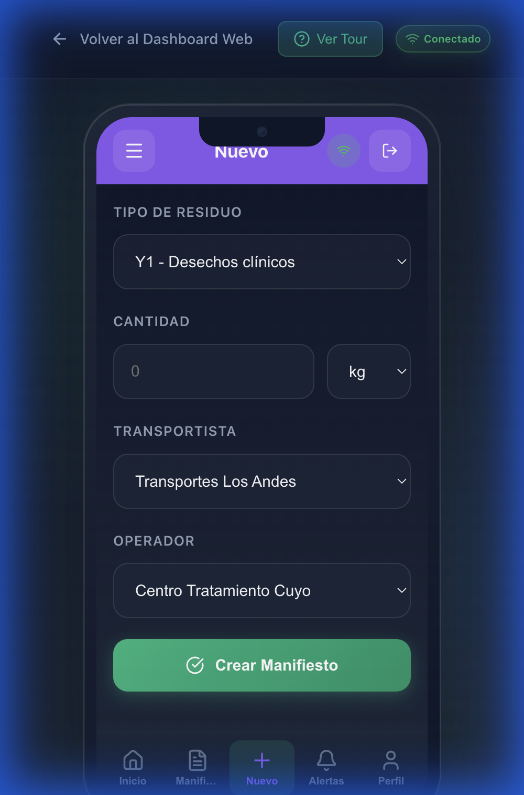

Formulario simplificado para móvil:
- Selector de tipo de residuo
- Ingreso de cantidad
- Selección de transportista
- Selección de operador

#### Historial

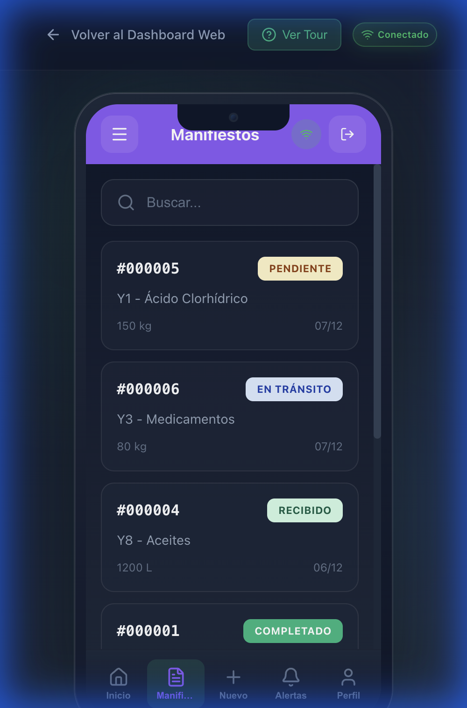

Lista de manifiestos con búsqueda y filtros.

---

### 3.4 Transportista (Móvil)

#### Dashboard de Ruta

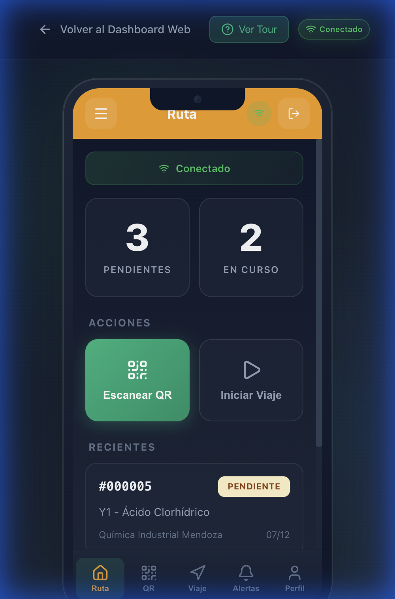

Panel principal con:
- Manifiestos asignados
- Viaje activo (si existe)
- Acciones rápidas

#### Escaneo QR (CU-T08)

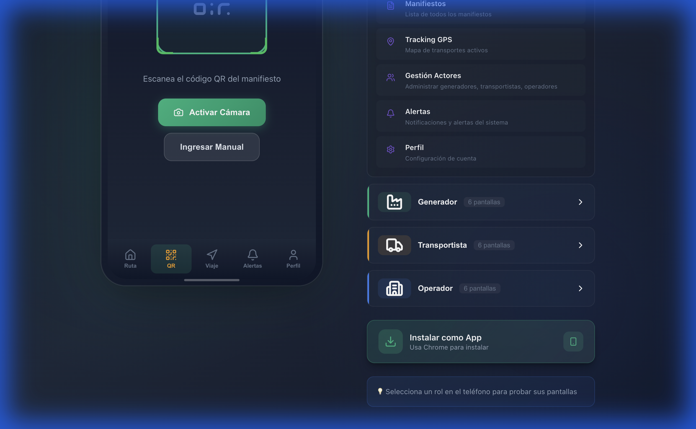

Permite:
- Escanear QR del manifiesto
- Cargar datos automáticamente
- Verificar información

#### Viaje Activo

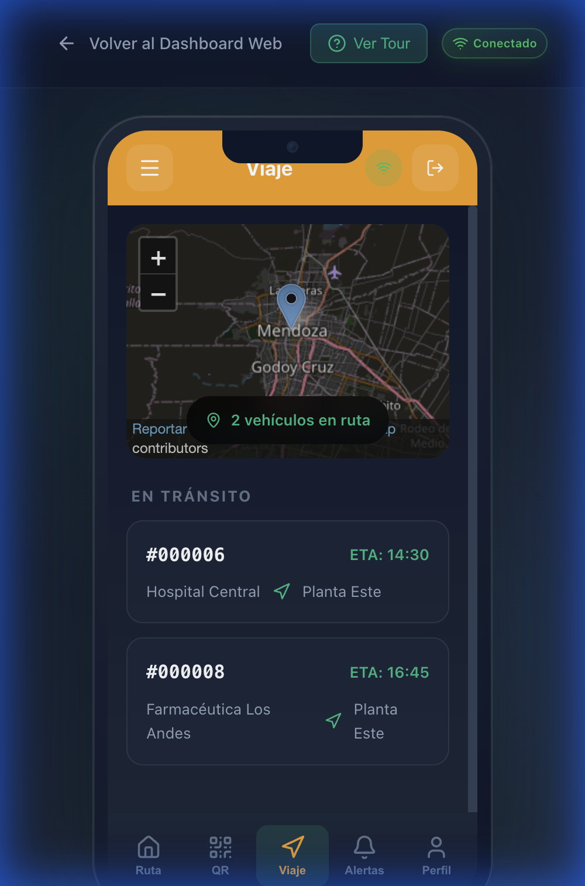

Durante el viaje:
- Temporizador de duración
- Ubicación GPS actual
- Botones de incidente y parada
- Confirmar entrega

#### Detalle de Manifiesto

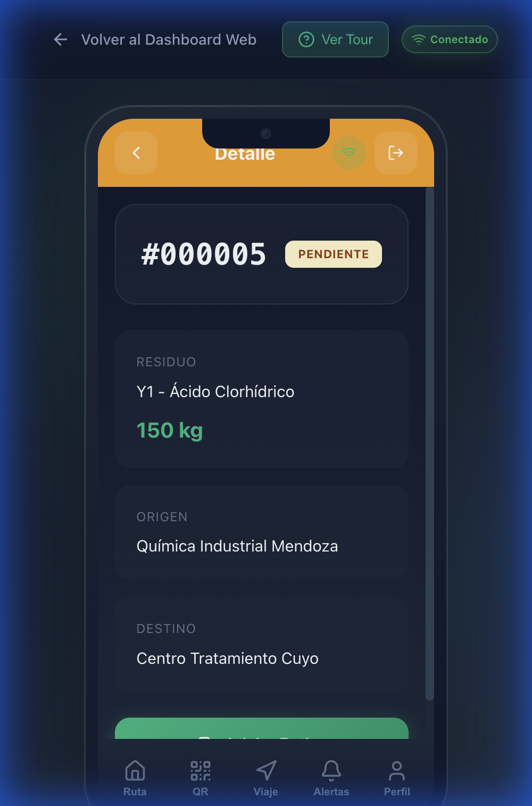

Información completa del manifiesto con acciones disponibles.

---

### 3.5 Operador (Móvil)

#### Dashboard Entrantes

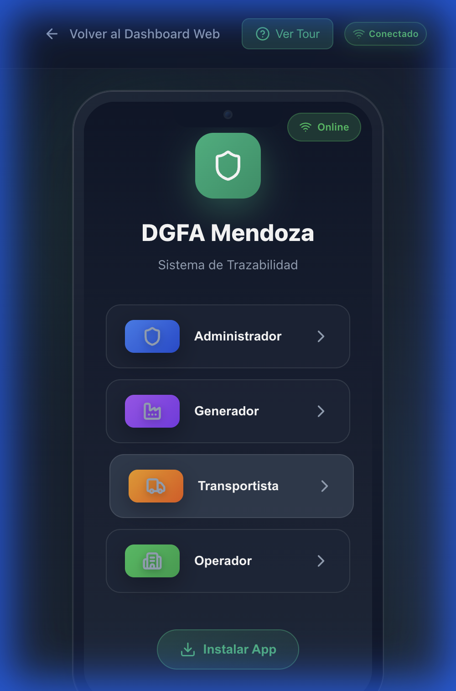

Vista de:
- Cargas entrantes con ETA
- Acciones de recepción
- Pesaje pendiente

#### Escaneo QR

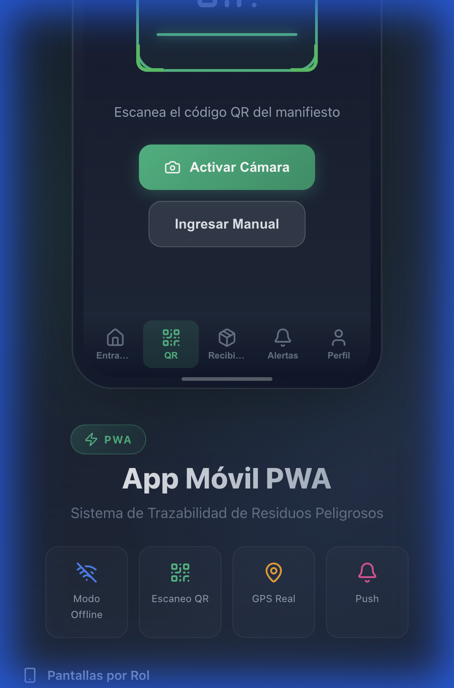

Para recepción:
- Escanear QR del manifiesto entrante
- Validar datos offline si es necesario
- Iniciar proceso de recepción

#### Recepción

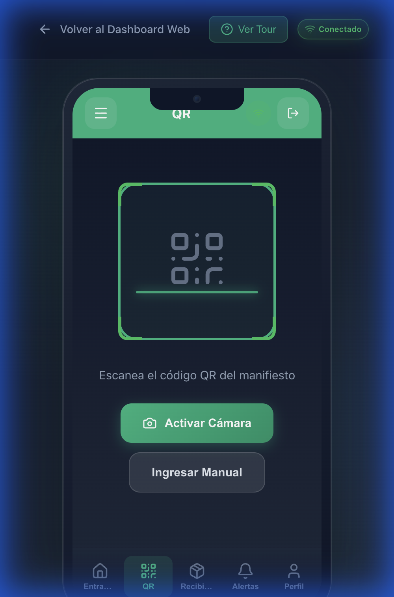

Confirmar:
- Datos del residuo
- Peso registrado
- Observaciones

---

## 4. CARACTERÍSTICAS TÉCNICAS

### 4.1 PWA - Instalable como App

La aplicación puede instalarse en dispositivos móviles:
- **Android**: Menú ⋮ → "Instalar aplicación"
- **iOS**: Compartir → "Agregar a pantalla de inicio"

### 4.2 Modo Offline (CU-T09)

- Funcionamiento completo sin conexión
- Sincronización automática
- Base de datos local cifrada

### 4.3 Notificaciones Push (CU-G11)

Alertas automáticas por:
- Cambios de estado
- Retiros y entregas
- Anomalías detectadas

### 4.4 Seguridad

- Autenticación con token 2FA
- Firma electrónica de documentos
- Log de auditoría completo (CU-A10)
- Cifrado de datos sensibles

---

## 5. ANEXOS

### 5.1 Referencia de Casos de Uso

| Módulo | Casos de Uso |
|--------|--------------|
| Autenticación | CU-A01, CU-G01, CU-T01, CU-O01 |
| Dashboard | CU-A02, CU-G02, CU-T02, CU-O02 |
| Manifiestos | CU-A09, CU-G03-G10, CU-T02-T08, CU-O02-O09 |
| Gestión Actores | CU-A03-A08, CU-G12, CU-T11 |
| Reportes | CU-A10-A12, CU-G09, CU-T10, CU-O11-O12 |
| Configuración | CU-A13-A15, CU-T09 |

### 5.2 Contacto

**Dirección de Gestión y Fiscalización Ambiental**  
Gobierno de Mendoza

## 4.4 Certificacion Blockchain de Integridad

El sistema utiliza la blockchain de Ethereum (Sepolia) para garantizar inmutabilidad mediante **2 sellos blockchain** + **rolling hash chain**:

- **Sello Genesis (APROBADO):** Certifica la identidad del manifiesto al momento de la firma
- **Sello de Cierre (TRATADO):** Certifica el ciclo de vida completo (todas las fechas, estados, eventos)
- **Rolling Hash:** En cada cambio de estado, un hash acumulativo encadena los datos — cualquier modificación rompe la cadena

La verificacion puede realizarse individualmente (panel blockchain en detalle del manifiesto) o masivamente (Admin > Blockchain > Verificar Integridad).

Endpoints asociados:
- `GET /api/blockchain/manifiesto/:id` — Estado blockchain con sellos
- `GET /api/blockchain/verificar-integridad/:id` — Verificacion completa (ADMIN)
- `GET /api/blockchain/verificar-lote` — Verificacion masiva (ADMIN)

---

## 6. ACTUALIZACION 2026-08-25 - ALTAS, OCR Y TRATAMIENTO INTERNACIONAL

Esta actualización aplica al código espejado de **SITREP** y **RPTRAZAR Mendoza**.

### 6.1 Estado funcional

- Las altas nacionales e internacionales están implementadas.
- El generador puede quedar habilitado con alcance `NACIONAL` o `INTERNACIONAL`.
- Los manifiestos internacionales pueden prepararse y editarse en estado `BORRADOR`.
- El manifiesto internacional incorpora transportista exterior, operador exterior y una declaración abierta de tratamiento internacional.
- La firma y las transiciones operativas internacionales están bloqueadas intencionalmente hasta definir el circuito de frontera, recepción, tratamiento y certificado. No se debe interpretar esta versión como un flujo transfronterizo completo.

### 6.2 Formulario modelo de altas para QA y capacitación

Se recuperó una ruta accesible para revisar los formularios sin crear cuentas ni modificar datos:

```text
/inscripcion/generador?modo=revision
/inscripcion/transportista?modo=revision
/inscripcion/operador?modo=revision
```

En modo revisión se pueden recorrer los pasos, adjuntar archivos de prueba y ejecutar OCR local. El aviso de la pantalla confirma que no se crea una cuenta, no se envían documentos y no se modifica ninguna solicitud.

> **Límite funcional:** los documentos generales de inscripción se cargan en el alta y se controlan desde **Administración > Solicitudes**. El botón **Nuevo actor** sólo permite elegir el tipo y abre el asistente completo correspondiente; no existe un alta rápida paralela. Los detalles operativos de Generadores, Transportistas y Operadores son de consulta y gestión específica; no vuelven a abrir el expediente general ni permiten emitir credenciales desde una pestaña no relacionada.

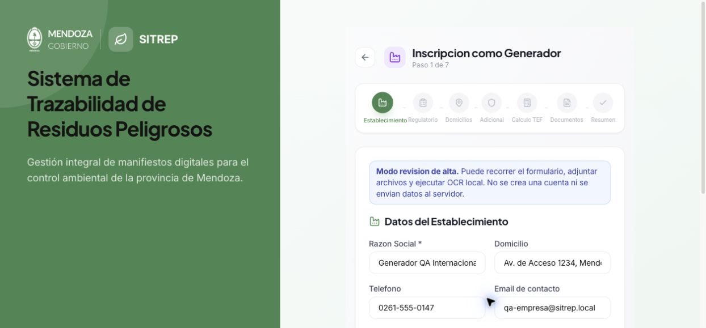

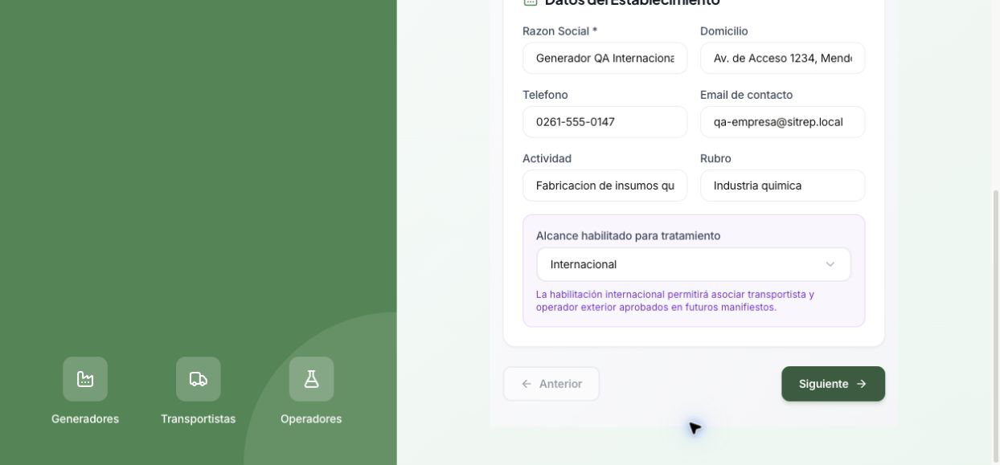

La captura anterior corresponde a una revisión local/QA del código actualizado. Después del despliegue deben renovarse las capturas en `https://sitrep.ultimamilla.com.ar/` y en RPTRAZAR Mendoza.

El análisis de dominio ampliado está documentado en [Análisis funcional de tratamiento internacional](ANALISIS-TRATAMIENTO-INTERNACIONAL-2026-08-24.md).

### 6.3 Capacidades nuevas de las altas

| Capacidad | Descripción |
|-----------|-------------|
| Alcance de tratamiento | Selector nacional/internacional en alta y edición de generadores; la aprobación pública copia el alcance al actor. |
| OCR asistivo | El OCR local propone campos, confianza y diferencias para que un responsable revise. Nunca aprueba, firma ni certifica por sí solo. |
| Documentos | Se mantienen tipos, vigencia, estado de revisión y trazabilidad de quién aprobó o rechazó. |
| ATM | Una referencia duplicada por el mismo actor se resuelve idempotentemente; otra identidad recibe conflicto. |
| Fixtures QA | Las referencias ATM y los números regulatorios de prueba se aíslan por corrida. |
| Revisión humana | La pantalla modelo permite validar contratos de UI, documentos y OCR sin efectos en base de datos. |
| Login e impersonación | Los E2E usan selectores estables para shell, errores de autenticación y navegación posterior a impersonar. |

Los wizards existentes de generador, operador y transportista siguen disponibles con sus representantes, corrientes Y, TEF, vehículos, choferes y adjuntos. Las capturas de referencia de los wizards se encuentran en `screenshots/desktop/W17_adm_gen_paso1.png`, `W24_adm_oper_paso1.png`, `W08_pub_oper_paso1.png` y `W15_pub_trans_paso3.png`.

#### OCR visible y documentos de flota

En el alta de transportista se ofrecen como documentos opcionales de soporte la **licencia de conducir** y la **cédula azul / identificación del vehículo**. En el modo revisión se puede ejecutar la demostración `Probar OCR de licencia` o `Probar OCR de cédula azul`; el ejemplo se genera en memoria y no se envía.

**Cómo cargar las caras y formatos:**

- Licencia de conducir y cédula azul requieren **frente y dorso**. Se pueden cargar como dos fotos separadas o como un único PDF completo; la pantalla identifica cada casilla como **Frente** y **Dorso**.
- Constancia AFIP, habilitación y seguro requieren una copia legible; si tienen varias páginas conviene usar el PDF completo.
- Se aceptan PDF, JPG/JPEG y PNG de hasta 10 MB. El botón **Tomar foto** usa la cámara trasera del teléfono cuando el navegador/dispositivo lo permite; si no, se utiliza el selector de archivos.
- El OCR local procesa imágenes JPG/JPEG/PNG. Un PDF se conserva y se remite para revisión; para reconocimiento inmediato conviene cargar fotos nítidas de cada cara.
- El OCR muestra propuestas para revisar: no aprueba ni modifica datos automáticamente. Si no termina en 30 segundos, informa el problema, libera el formulario y conserva el archivo para revisión manual; un OCR sin resultado no significa documento inválido ni aprobado.

El reconocimiento usa Tesseract local para proponer, según el documento:

- licencia: apellido, nombre, DNI, número de licencia, clase y vencimiento;
- cédula azul: dominio/patente, titular, DNI/CUIT, marca, modelo y vencimiento;
- otros documentos: identificador y vencimiento cuando las etiquetas son legibles.

Cada valor lleva confianza y queda marcado como **propuesta para revisar**. El OCR nunca aprueba, firma ni habilita automáticamente. En expedientes persistidos, el OCR backend guarda texto, motor, confianza y campos; el responsable debe confirmar los valores antes de aprobar. La asociación exacta a un chofer o vehículo se completa desde **Flota y Conductores > Documentación** sobre la fila correspondiente; no se usa un expediente general del transportista, evitando atribuir un documento a la unidad o persona equivocada.

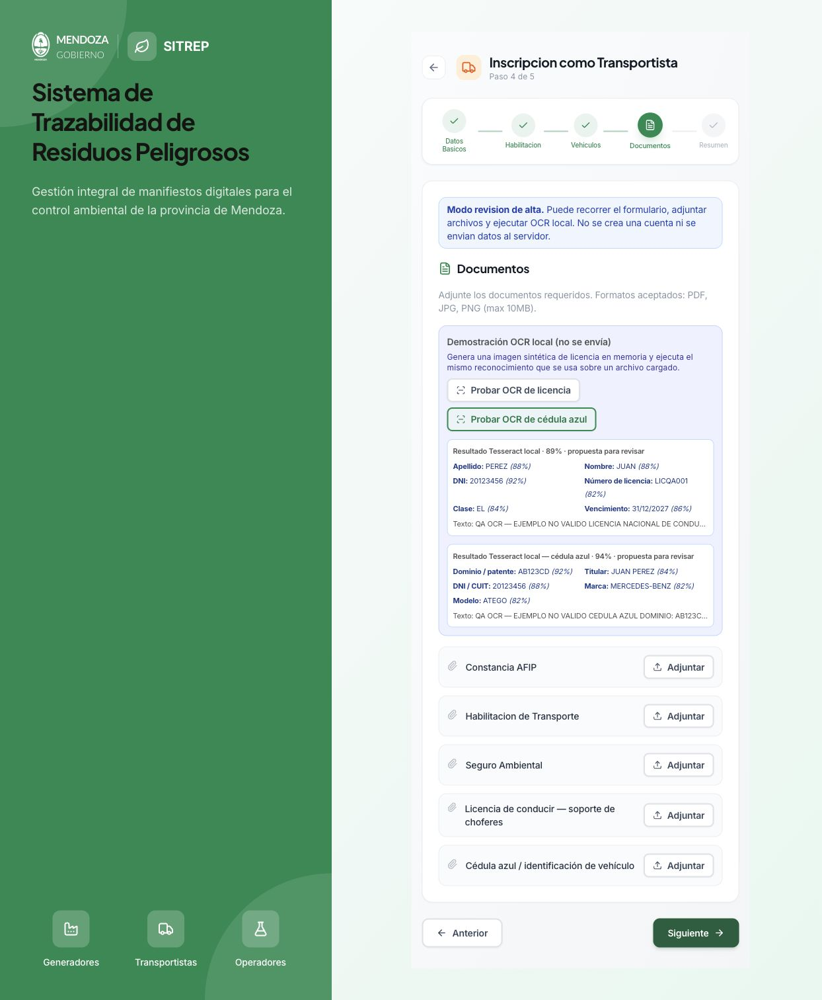

#### TEF diferido

El alta ya no muestra un importe MxR que se recalcule al tocar variables. El usuario sólo declara zona, personal, potencia, superficie, criterios A1–A10, corrientes Y e ISO. La pantalla muestra **Importe pendiente de cálculo final**.

La liquidación final es autoritativa en backend: usa la versión fija de la regla vigente, descarta `factorR`, `montoMxR`, `TEF` o `MxR` enviados desde el navegador y calcula al aprobar/guardar administrativamente. Esto evita que una cifra presentada por el cliente se tome como importe fiscal. La pantalla de cierre indica que el importe queda pendiente de liquidación.

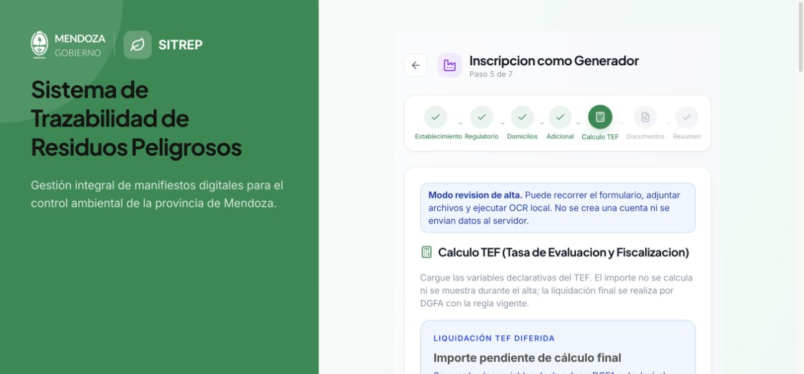

### 6.4 Tratamiento internacional y entidades exteriores

Las entidades exteriores no se mezclan con los actores locales. Cada registro debe indicar:

- tipo: transportista u operador;
- razón social y país;
- identificador fiscal de la jurisdicción correspondiente;
- contacto operativo;
- licencia/habilitación y evidencia asociada;
- estado, que debe ser `APROBADA` para poder seleccionarse.

Para preparar un manifiesto internacional:

1. Habilitar al generador con alcance `INTERNACIONAL`.
2. Registrar y aprobar el transportista exterior.
3. Registrar y aprobar el operador exterior.
4. Crear el manifiesto y seleccionar `INTERNACIONAL`.
5. Seleccionar transportista exterior y operador exterior.
6. Completar la declaración de tratamiento internacional (texto libre, hasta 4.000 caracteres).
7. Guardar como borrador y realizar revisión administrativa/regulatoria.

El PDF del manifiesto incorpora el alcance, la declaración y la identificación de las entidades exteriores. No se debe combinar un actor local con una entidad exterior en el mismo rol. Los manifiestos nacionales conservan el flujo local: aprobación, retiro, entrega, recepción, tratamiento y certificado.

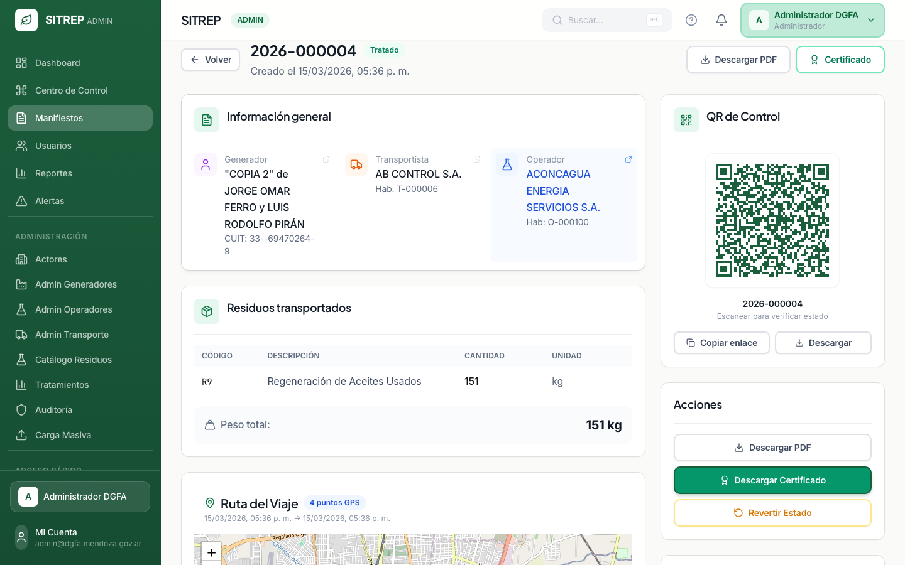

La captura es una referencia del detalle y documentación final. La variante internacional agrega sus campos propios y no puede firmarse hasta que exista un workflow internacional aprobado.

### 6.5 Límites y decisiones que faltan

Antes de habilitar la operación internacional completa se deben definir:

- estados y firmas de despacho, frontera/aduana, recepción exterior, tratamiento y cierre;
- autoridades, países, permisos, seguros, convenios y normativa aplicable;
- documentos por jurisdicción, vencimiento, idioma, traducción, apostilla y legalización;
- husos horarios, moneda, unidades, contactos 24x7, GPS fuera del país y contingencia offline;
- reglas de certificados, QR, verificación pública, reportes y KPIs nacionales/internacionales;
- snapshot histórico del alcance y de los actores usados en cada manifiesto;
- pantalla administrativa para mantenimiento del catálogo de entidades exteriores, si se requiere operar sin API o carga técnica;
- migración, backup, smoke test y rollback en ambos entornos, sin reiniciar el VPS de Gobierno.

### 6.6 Evidencia de pruebas

| Suite | Resultado | Alcance |
|-------|-----------|---------|
| SITREP backend | 294/294 PASS | Unitarias/integración, documentos, OCR estructurado, TEF autoritativo, actores, manifiestos y concurrencia ATM. |
| SITREP frontend | 82/82 PASS | Componentes, formularios, revisión de altas, permisos y flujos de UI. |
| Builds SITREP y RPTRAZAR | PASS | Backend, frontend, PWA y Prisma. |
| E2E remoto en VPS | Pendiente | La VPN/VPS no quedó visible desde este entorno; falta aplicar migración y correr el test integral en ambos servidores. |

---

*Documento actualizado - 25 de agosto de 2026*
