# Alineación de referencias accionables del mapa

## Estado prevalente: reapertura de coherencia, no aprobación global

Se amplió la corrección de filtros al encabezado público del manifiesto por
dos observaciones del usuario que la revisión anterior omitió: tilde en otra
fila y número oscuro/desalineado sobre verde. Se reconocen esas omisiones;
los pases de geometría SVG y de glifos no acreditaban la composición completa.
La fuente844639c completó QA82:472BE/969FE unit, tres builds y los grupos
HTTP/SQL aprobados;138/141E2E, sólo los tres fallos conocidos de agendaT2.
La cabecera se verificó blanca y alineada en las tres superficies. La revisión
de24PNG originales también reprodujo etiquetas superpuestas en Monitor y un
botón flotante que tapaba una ficha en la app. Este último está corregido en
53c8531 y validado en QA83 completa:472BE/975FE unit y los mismos grupos
HTTP/SQL PASS;138/141E2E, sólo los tresT2 conocidos. Cabecera y ciclo del
manifiesto ampliado aprobaron en escritorio, responsive yappweb. Los9PNG
seleccionados de83 se revisaron personalmente; no equivale a toda la UI.
No hay despliegue ni declaración de UI perfecta/toda superficie cubierta.

La guía de diseño influyó en conservar marca, fuentes y paleta, agrupar la
cabecera por columnas y corregir el componente compartido en lugar de añadir
efectos o reglas globales de tipografía. La guía de pruebas exigió medición
renderizada y capturas nativas además de unit y builds.

## Alcance y contrato

Corrección solicitada por el usuario del centrado y padding de Generadores,
Transportistas, Operadores y En Tránsito. Se incluye Inspecciones, que usa el
mismo componente, y los consumidores de `MapCategorySymbol` en filtros y filas
de Reportes. No es una revisión visual certificada de todas las pantallas.

Se conservan Lucide, los colores `ACTOR_COLORS`, las formas de cada categoría,
los nombres accesibles, `aria-pressed`, los contadores reales —incluido cero— y
las acciones existentes. Login azul, sistema verde y marca sin cambios.
Backend, permisos, capas Leaflet y fuentes de datos no se modifican.

## Causa y corrección acotada

Antes, el símbolo tenía fondo de 20 px y SVG de 14 px. El fondo transportista
rotaba 45° con el SVG contrarrotado: la caja de flujo no reservaba la huella
visual del rombo. El margen del marco SVG en los ejes locales del rombo era
`10 - 7 × √2 ≈ 0,10 px`; en las otras categorías era 3 px.

Ahora, una caja de 36 px reserva la huella del fondo de 24 px, incluido el
rombo de aproximadamente 33,94 px. Fondo e ícono ocupan el mismo centro de una
grilla; sólo el fondo rota. El marco SVG mantiene 14 px, con 5 px de margen en
cuadros/círculo y aproximadamente 2,10 px en los ejes del rombo. Son medidas
del marco del SVG, no una afirmación de padding óptico de cada trazo.

El apilamiento queda aislado dentro del símbolo: el SVG se pinta delante de su
fondo sin elevarse sobre mapas, menús o paneles. No se añaden efectos, timers,
peticiones ni dependencias. El riesgo de ensanchar controles y filas exige
verificación renderizada de los textos largos en móvil.

La primera captura del ajuste detectó que «Transportistas» invadía el padding
derecho, aunque el texto seguía dentro del botón y la comprobación antigua
aprobaba. En móvil se compactan el gap y padding horizontal usando tokens
existentes. El ajuste de 6 px no alcanzó: QA76 reprodujo invasión del padding
en las dos superficies móviles. La segunda iteración usa 4 px de gap/padding
horizontal. QA77 aprobó geometría/acciones, pero su captura de 320 px mostró
palabras partidas; no se aprueba ese resultado visual. La tercera iteración
elimina esa partición y usa columnas automáticas de mínimo 8,75rem, acotadas al
ancho disponible: dos cuando caben, una cuando no. Escritorio conserva el
flex existente, 8 px de gap y 10 px de padding. La altura adicional en
pantallas estrechas es un tradeoff explícito para preservar las etiquetas.
El control conserva su altura táctil y la caja del símbolo. El helper ahora
exige texto dentro del área de contenido descontando bordes y padding.

## Pruebas

- Cinco unit nuevas verifican decoración oculta a lectores de pantalla, color,
  separación fondo/ícono, rotación exclusiva del fondo y tamaño/glifo SVG.
- Las pruebas de consumidores siguen exigiendo los mismos colores, glifos,
  estados, roles y callbacks; sólo buscan el color en el nuevo elemento fondo.
- Un recorrido Playwright por cada superficie mide centro, padding transformado,
  espacio reservado, color, trazo, tamaño, legibilidad y estabilidad al alternar.
  El helper exige además etiquetas completas en una línea, sin palabras partidas.
  Recorre Centro de Control → las cuatro capas → Reportes → teclado para ocultar
  y restaurar un marcador real → fila de transportista.
- La caché legítima de React Query se respeta: se usa la acción real Actualizar
  ahora para exigir una respuesta HTTP actual con las capas seleccionadas.
- Tres superficies: escritorio 1440×900, responsive 360×800, `/app/` 360×800.
  Se añaden comprobaciones de contenido, símbolos y capturas a 320×800 en
  ambos recorridos móviles, restaurando después el tamaño de 360 px.
  Playwright existente, una VM GitHub, worker1/retries0. Browser plugin not available.
  Sin navegador, Docker, API, DB ni emulador Android locales.
- Los tres fallos territoriales transportista del informe anterior permanecen
  en el focal; no se excluyen, marcan esperados ni se resuelven mediante este CSS.
  El paquete completo exige ahora 141 E2E, no el subconjunto focal de 24.

## Resultados

Referencia74 / `37298970767`, fuente `30d968f` sin cambios de producto:
472BE/962FE unit, tres builds, 54HTTP, 2SQL, 3calendario y 5territorial PASS.
Focal18PASS/6FAIL/0flaky/0skip. Tres fallos territoriales preexistentes y tres
timeouts del montaje al esperar red para queries frescas; no tres bugs nuevos.
Trace original confirma centros exactos, SVG14px y padding3px/0,100508px.
No se alcanzaron las aserciones finales del nuevo recorrido. Capturas antes
conservadas; cleanupSUCCESS/cierre11:01:48.093UTC.

Iteración75 / `37300415275`, fuente `76bd89e`: 472BE/967FE unit, tres builds y
los mismos gruposHTTP/SQL PASS. Focal18PASS/6FAIL/0flaky/0skip. Las tres nuevas
fallas son un selector ambiguo entre la fila nativa y el marcador Leaflet con
el mismo nombre; se alcanzaron los filtros y la ocultación/restauración real
del marcador, pero no las aserciones finales. No presentarlas como tres bugs
de la app ni tres recorridos completos aprobados. Capturas Centro/Reportes
mostraron padding SVG mejorado y el problema móvil del texto descrito arriba.
CleanupSUCCESS/cierre11:10:29.312UTC.

Iteración76 / `37301878627`, fuente `87b227b`:472BE/967FE unit PASS,
tres builds PASS,54HTTP/2SQL/3calendario/5territorial PASS. Focal17PASS/7FAIL,
0flaky/0skip. El nuevo recorrido de escritorio completó mediciones: centros
dx≤0,000016px/dy0, padding5px/2,100497px, glyph14px y colores correctos,
fondo dentro de la reserva, sin errores ni warnings de consola. Cuatro fallos
son la misma invasión del padding de «Transportistas» móvil, tanto en el nuevo
recorrido como en la prueba contextual existente; los otros tres son T2.
No es aprobación móvil. Captura fresca y test estricto conservados antes de
la segunda corrección horizontal. ZIP final único39.520.931bytes en el disco
externo, sin descargar el resumen adicional. CleanupSUCCESS y cierre
11:25:36.197UTC detuvieron runtime5767/server5768.

Iteración77 / `37306298373`, fuente `f788e81`:472BE/967FE unit PASS,
tres builds PASS,54HTTP/2SQL/3calendario/5territorial PASS. Focal21PASS/3FAIL,
0flaky/0skip,163882ms. Los tres recorridos nuevos aprobaron; sólo fallan T2.
Geometría Control/Reportes/filas/320px: dx/dy≤0,000016px, SVG14px, padding5px
y mínimo2,100496px en rombo, colores y trazo correctos, fondo contenido.
Sin errores/warnings de consola en los tres recorridos. Las capturas360px
son legibles y centradas, pero320px parte cuatro etiquetas en dos líneas.
Se conserva esa evidencia; no es un GO visual aunque no recorte palabras.
ZIPfinal único32.211.904bytes,13PNG seleccionados, no websummary extra.
CleanupSUCCESS/cierre12:06:27.853UTC detuvo runtime5776/server5777.

### Resultado anterior QA78 — no verifica alineación del tilde

Fuente probada exacta `2d62c9609eb2989bb10c51377dc7f1f906c091a9`,
[ejecución37308100305](https://github.com/martinsantos/peliresi/actions/runs/37308100305).
Los cambios documentales y las cuatro capturas añadidas posteriormente no
son una segunda ejecución de producto. La rama es `codex/sitrep-cloud-qa-20261002`.

| Grupo | Resultado medido |
| --- | --- |
| Unit backend, DB desconectada | 472PASS / 0FAIL / 0pending |
| Unit frontend | 967PASS / 0FAIL / 0pending |
| Compilaciones backend/web/app | 3PASS |
| Grupos HTTP reales | 54PASS / 0FAIL |
| Subscriber compilado/PostgreSQL | 2PASS / 0FAIL |
| Calendario de Monitor HTTP | 3PASS / 0FAIL |
| Permisos territoriales HTTP | 5PASS / 0FAIL |
| E2E focal completo de esta tanda | 21PASS / 3FAIL / 0flaky / 0skip |
| Nuevos recorridos de geometría/interacción | 3PASS / 0FAIL |
| Android/APK y paquete de promoción | No ejecutados |

El focal duró163790,504ms. Los tres fallos conservados corresponden al mismo
defecto territorial preexistente: transportista2 recibe por API el viaje global
`2026-990001`, pero «Agenda y viajes» lo oculta en las tres superficies.
No son fallos nuevos del símbolo ni una aprobación global de la aplicación.
El workflow completo terminó FAILURE y no generó paquete de promoción.
La suite completa de141E2E no se ha ejecutado sobre esta corrección; este
subconjunto de24 no la reemplaza.

### Verificación renderizada y visual

Entorno aislado `http://127.0.0.1:4177`, rutas `/centro-control`, `/reportes`
y sus equivalentes `/app/`, login real de cuenta sintética. Escritorio1440×900;
responsive yappweb360×800, con casos adicionales320×800 en ambas.
Playwright existente en GitHub, worker1/retries0; ninguna API de negocio
interceptada ni sesión ficticia. El prefijo `/app/` no equivale al APK instalado.

| Comprobación en los tres nuevos recorridos | Estado |
| --- | --- |
| Identidad SITREP y contenido significativo, no página vacía | PASS |
| Sin overlay de compilación ni desbordamiento horizontal final | PASS |
| Consola del recorrido, errores y warnings | 0 / 0 |
| Padding/centrado/color/glifo/espacio reservado | PASS |
| Etiquetas completas en una línea y contenido dentro del padding | PASS,320/360px incluidos |
| Activar/desactivar cuatro capas con respuesta HTTP real y tamaño estable | PASS |
| Teclado oculta/restaura un marcador real de transportista en Reportes | PASS |
| Revisión visual del agente de13PNG originales seleccionados | Realizada, pero omitió detectar el tilde en otra fila; no aprueba la composición completa |

Se midieron83marcosSVG entre las tres superficies y los diferentes estados;
no son83pantallas ni83íconos únicos. SVG14×14px, trazo blanco, fondo dentro
de la reserva en todos los casos. Desviación máxima de centro en cualquiera
de los ejes0,0000153px; padding de cuadros/círculo5px, mínimo en rombo
2,100496px. Son medidas del marcoSVG, no del contorno óptico de cada trazo.

La inspección de capturas corrigió dos problemas que un test anterior dejaba
pasar: invasión del padding por el texto y partición de palabras a320px.
Ahora360px conserva dos columnas y320px pasa a una. Aumenta la altura de la
botonera muy estrecha; las etiquetas permanecen completas y el scroll normal
del documento se conserva. Reportes y sus filas usan el mismo símbolo;
Monitor reutiliza marcadores compartidos, pero no esta botonera.

### Comando y evidencia

```sh
gh workflow run certification-tests.yml --repo martinsantos/peliresi \
  --ref codex/sitrep-cloud-qa-20261002 \
  -f unit=true -f android=false -f load_only=false \
  -f context_only=true -f alert_only=false
```

No repetir este comando por inercia: es el registro de la tanda terminada.
Crudos finales en el ZIP único externo `map-symbol-run78-final.zip`,
artifact11344648446,31.957.920bytes. No se descargaron el resumen adicional
de16,75MB, builds ni dependencias. Las cuatro capturas del informe son copias
byte por byte de las capturas nativas del navegador, sin edición de imagen.
El conjunto original seleccionado conserva13PNG y las tandas fallidas previas.

Closure12:22:44.026UTC detuvo runtime5745/server5746; cleanupPostgreSQL SUCCESS,
workflow COMPLETED. Proveedores externos deshabilitados; no envíos, datos
reales, despliegue, servicios o configuración de producción modificados.
No quedan procesos QA locales ni otra VM despachada por esta tarea.

## Límite de entrega

No se despliega en esta tanda. La publicación protegida sigue pendiente y los
fallos funcionales del informe territorial no se ocultan detrás del arreglo
visual. APK autenticado instalado por el usuario, hardware físico, Safari y las
superposiciones de etiquetas del Historial de Monitor no se certifican aquí.

Lección del incidente: comprobar legibilidad y existencia de glifos no verifica
su padding ni su huella rotada. Tampoco medir el símbolo de categoría verifica
la alineación entre ese símbolo, la etiqueta y el indicador de selección.

## Reapertura por observación del usuario: tilde descentrado

El usuario detectó una omisión real de la revisión anterior. En móvil el
`MapLayerToggle` de QA78 ponía la etiqueta en `block` y el tilde en otro
contenedor con `mt-0.5`: segunda fila. El símbolo se centraba respecto de las
dos filas juntas. Las capturas QA78 conservadas debajo son evidencia previa,
no una aprobación de esa composición. No se repite esa versión sólo para
fabricar una reproducción: la fuente y los PNG originales ya la conservan.

Candidato `7e1c4dd8673398dba65006f24857616763f7ae10`,
[QA79 /37311565051](https://github.com/martinsantos/peliresi/actions/runs/37311565051),
terminó COMPLETED/FAILURE por los tres fallos territoriales conocidos, no por
el nuevo contrato de alineación.

Corrección compartida, no parche de una pantalla: símbolo, etiqueta/contador
y estado son ahora elementos de una misma fila centrada; el SVG de estado
usa `display:block`, sin alineación implícita a baseline. Los grupos de Centro
de Control y Reportes reservan mínimo12rem por control —acotado al espacio
disponible— antes de añadir columnas; no parten ni ocultan las etiquetas.
Se mantiene la reserva del rombo y el contrato funcional/accesible anterior.
El cambio puede aumentar altura de la botonera móvil: exige revisar320/360px
y acceso al mapa, no sólo el recorte del botón.

El test renderizado conserva todos los controles anteriores y añade: centros
verticales del SVG de categoría y del SVG Check/EyeOff respecto de la caja de
línea de la etiqueta (desviación≤1px), orden horizontal y estado dentro del
padding. Registra geometría en el recibo, incluyendo desactivación/reactivación
por mouse y teclado. Una unit nueva protege nombre accesible, contador real y
callback al cambiar el estado separado; no se usa jsdom para certificar CSS.

La coherencia global sigue abierta. Este incidente exige probar la composición
completa, no aprobar todo el software por glifos presentes, unit verdes ni un
arreglo de filtros. Ramas conocidas sin resolver aquí: viajes globales ocultos
al transportista, etiquetas superpuestas del Historial de Monitor, revisión
de selecciones/estados/contraste/tablas en todos los formularios y fichas y
sesión autenticada del APK. La auditoría de fuente adicional encontró que la
verificación pública del manifiesto representaba «Operador» con `Building2`,
mientras detalle/mapas usan `FlaskConical`. Se aborda como caso de coherencia
de identidad en el candidato siguiente, no como permiso nuevo ni rediseño de
la verificación. No se despliega ni certifica todaUI.

### Resultado QA79: composición completa, no sólo marco SVG

Crudos leídos del ZIP final único `map-symbol-run79-final.zip`,
artifact11345593328,30.093.544bytes.472BE/968FE unit PASS,0FAIL/0pending;
tres builds PASS;54HTTP,2SQLsubscriber,3HTTPcalendario,5HTTPterritorial PASS.
E2Efocal21PASS/3FAIL/0flaky/0skip,141503,916ms; tres recorridos de mapas PASS.
Los tres fallos son exactamente T2/Agenda y viajes; no se omiten ni se marcan
esperados. Android, paquete y suite completa141E2E no ejecutados.

La nueva medición registró200composiciones a través de estados y tamaños
(60escritorio+70responsive+70app): desviación de centros categoría/etiqueta
y Check-EyeOff/etiqueta0px en todos los casos; orden horizontal y padding del
estado correctos, sin colisión de texto, etiquetas en una línea y alto táctil≥44.
Son200observaciones repetidas, NO200pantallas ni componentes únicos. Los
83marcosSVG mantienen centro≤0,0000153px/padding5px y rombo≥2,100496px.
Errores/warnings de consola0/0 en los tres recorridos; API no interceptada.

Revisados13PNG nativos de79: los dos mapas en escritorio, responsive yapp,
grupos320/360 y tres vistas completas deapp. Ahora icono, texto, contador y
tilde comparten la fila; a320/360 se usa una columna para no comprimir nombres.
Ese mayor alto de la botonera sigue dejando acceso al mapa mediante scroll
normal. No se aprueban los otros detalles del cuerpo: las cabeceras móviles
«Centro de Con…»/«Actores de las capas seleccio…» siguen truncadas y la
revisión de Historial de Monitor no forma parte de este recorrido.

Cierre12:50:08.780UTC detuvo runtime5488/server5489; cleanupGitHub yPostgreSQL
SUCCESS, runCOMPLETED antes de iniciar80. Runtime-proof confirma compiledAPI,
DBsintética y email/push/blockchain false. No procesos pesados locales,
envíos, automatizaciones, agentes ni publicación.

### Resultado QA80: identidad del actor; la captura detectó otro defecto

Fuente exacta `1ecb955bd9cfff4e86e5e0f5f8ebc3927e4880c8`,
[QA80 /37313004726](https://github.com/martinsantos/peliresi/actions/runs/37313004726),
terminado COMPLETED/FAILURE. Mantiene el arreglo del tilde. El único cambio
adicional de producto es `Building2`→`FlaskConical` para Operador en
`VerificarManifiestoPage`; no altera layout, tamaño16px, tono azul, API ni datos.
El contrato se escribió primero en una unit del componente y después se
cambió el glifo; la discrepancia anterior está probada por fuente, no se afirma
una ejecución roja separada de esa nueva unit.

El E2E existente ahora continúa a la verificación del manifiesto sintético
`2026-990001` y exige respuesta real200, nombre de cada actor devuelto y su
glifo Factory/Truck/FlaskConical, sin enlaces a fichas privadas. Captura nativa
en las tres superficies. No añade endpoints públicos ni amplía visibilidad.
Crudos finales del ZIP único `map-symbol-run80-final.zip`, artifact11347340732,
31.735.239bytes:472BE/969FE unit PASS,0FAIL/0pending; tres builds PASS;
54HTTP/2SQLsubscriber/3HTTPcalendario/5HTTPterritorial PASS. Focal21PASS/3FAIL,
0flaky/0skip,172070,538ms; los tres recorridos mapa/verificación PASS.
Los tres fallos siguen siendo T2/Agenda y viajes. Alineación de200observaciones
categoría/etiqueta/estado0px; consola0errores/0warnings yAPI real sin interceptar.
Cierre13:05:15.432UTC detuvo runtime5781/server5782; cleanupSUCCESS yDB
cerrada, proveedores externos false. Android y paquete no ejecutados.

La inspección visual de los tres PNG públicos —escritorio, responsive yapp—
detectó un fallo no cubierto por las aserciones anteriores: el número del
manifiesto está oscuro sobre el verde y empieza en una columna diferente de
la etiqueta. No se aprueba visualmente esa cabecera aunque el glifo esté bien.
No afirmar un ratioWCAG medido: la evidencia es el color oscuro renderizado
y la composición incongruente. Los PNG80 originales se conservan.

### Reapertura por título oscuro/desalineado, QA81 cancelada y QA82 completa

La regla base de `index.css` asigna neutral900 directamente a todos los
encabezados. El `text-white` del contenedor público no se hereda por el H1.
La corrección mínima declara `text-white` en el propio H1 y agrupa etiqueta y
número en una columna de texto; el Shield ocupa una reserva24px separada.
No se cambia la regla global, paleta, tipografías, sombras, permisos ni API.
Riesgo previsto: una línea adicional de etiqueta en móvil estrecho; se debe
verificar contención, no solapamiento, columna común y acceso al botón inferior.
No se agregan posiciones sticky/fixed ni nuevos z-index.

La unit existente exige blanco explícito y columna compartida. El E2E exige
el color realmente computado `rgb(255, 255, 255)`, desvío horizontal≤0,5px,
separación vertical y los mismos datos/glifos públicos; no usa jsdom como prueba
de contraste. Contratos escritos antes del cambio; no se afirma una ejecución
roja separada de estas aserciones.

QA81/37314730081 se canceló al detectar el defecto en la captura80, durante
unit, para no gastar una tanda completa sobre ese candidato. COMPLETED/CANCELLED,
cleanupSUCCESS confirmado antes de editar o despachar82; no cuenta como pase.
QA82/37316184218 probó fuente exacta844639c8421ac5866042f4ed0d3560ec08477576,
unit=true/android=false/context_only=false: suite completa, no subconjunto.
Terminó COMPLETED/FAILURE por los tresT2 conservados. Crudos del ZIP final
único80.015.253bytes, artifact11348184936:472BE/969FE unit PASS,0FAIL/pending;
tres builds PASS;54HTTP/2SQLsubscriber/3HTTPcalendario/5HTTPterritorial PASS.
141E2E:138PASS/3FAIL/0flaky/0skip,969188,268ms. Nuevosmapa/public3PASS:
H1rgb(255,255,255),desvío decolumna0px,separación vertical correcta en las
tres superficies; errores/warnings0/0 en esos recorridos. No afirmar ratio
WCAG medido ni aprobación de toda la interfaz por esas aserciones.
Cierre13:44:03.983UTC detuvo runtime5763/server5764; cleanupPostgreSQLSUCCESS
y proveedores externos apagados, antes de editar/despachar83. Android/APK y
paquete de promoción no ejecutados; ningún despliegue.

Revisión transversal de fuente del patrón de títulos: MainLayout declara
neutral900 sobre cabecera blanca; MobileLayout yQRScanner declaran blanco en
sus títulos oscuros; AuthLayout usa `.auth-brand-panel h1 { color:white }`
en el login azul; CardHeader/Modal usan título oscuro en superficie blanca.
No se cambian por suposición. MobileRoleHero contiene un título que hereda el
problema, pero no tiene consumidores en la fuente activa: hallazgo latente,
no bug renderizado certificado, no se borra ni se altera código no montado.
Esto es triage de fuente, no prueba visual de todos sus estados.

### Revisión visual transversal de24PNG QA82

Se inspeccionaron los archivos PNG originales seleccionados, sin editar,
recortar ni convertir; no se revisaron todos los PNG del ZIP ni todos los
estados de cada página. No equiparar esta selección a toda la superficie.

| Flujo / archivos nativos | Selección revisada y observación |
| --- | --- |
| `public-manifest-actor-icons.png` | Desktop/responsive/app: título blanco, columna común y datos públicos/glifos correctos. Etiqueta de cabecera envuelve en móvil; botón inferior sigue visible. |
| `control-map-controls.png`, `report-map-controls-320.png` | Tres capturas: fila categoría/texto/estado centrada y etiquetas completas; móvil de una columna, no dos columnas comprimidas. |
| `monitor-last-30-days-paused.png` | Desktop/app: selector30días usable, PERO etiquetas de eventos superpuestas y globo de viaje cortado en móvil. NO GO visual del mapa. |
| `select-choices-before-search.png` | Desktop/app: opciones accesibles sin abrir inmediatamente búsqueda/teclado; el nombre largo de una opción se trunca. No acredita teclado físico. |
| `manifest-completed.png` | Desktop/app: acciones de cierre/certificado y glifos correctos. En app el FAB verde tapa la zona del enlace de transportista; nuevo defecto reproducido, no aprobado. |
| `inspection-save-notice-safe.png` | Desktop/app: títulos blancos/verde, campo y acciones visibles; aviso móvil ocupa espacio significativo, sin afirmar ergonomía perfecta. |
| `head-ready-to-approve.png` | Desktop/app:21/21 controles reales y acción de jefatura visible. Tabs móviles permiten scroll; no se certifica todo estado del expediente. |
| `catalogue-preview.png` | Desktop/app: modal blanco, título oscuro y acciones contrastadas. Contenido móvil scrolleado con pie separado; simulación no envía ni crea casos. |
| `generadores-detail.png` | Desktop/app: ficha con nombre y glifo correctos, secciones/tabs visibles. No valida todos los largos/valores de ficha. |
| `reports-toolbar.png` | Desktop/app: controles de período/exportación visibles; tabs horizontales en móvil. Captura no certifica todos los gráficos ni consistencia de cada microícono. |
| `operator-temporary-session.png` | Desktop/app: salida de vista temporal explícita y legible; recorrido de sesión real PASS. No cambia rol base ni permisos. |

El fixture y navegador explican nombres QA, contadores dinámicos y formato
nativo de fechas `mm/dd/yyyy`; no se sustituyeron por datos de producción ni
se modificaron formalidades por la apariencia de ese control del navegador.

### Corrección adicional reproducida: FAB sobre ficha, QA83 final

Fuente53c85312dadbba8f4ed07ad71dca906b8cac1a70,
[QA83 /37321169318](https://github.com/martinsantos/peliresi/actions/runs/37321169318),
unit=true/android=false/context_only=false. No se solapó con82, cuyo cierre
se confirmó antes de editar/despachar83. Resultado final COMPLETED/FAILURE:
no se ocultan los tres casos funcionales pendientes.

`MobileLayout` usaba `pathname.includes('/manifiestos')` y montaba el botón
de creación fixed/z30 en cualquier detalle. La captura82app muestra que tapa
el enlace a la ficha. Ahora sólo se monta en la ruta exacta de listado, con
o sin prefijoapp y barra final. Permisos ADMIN/GENERADOR, acción de creación,
aspecto del botón, navegación inferior y padding existentes se preservan.
No se añade sticky/fixed/z-index ni se retoca la ficha o el workflow.

Seis unit nuevas comprueban navegación listado→alta para ambos roles y ausencia
del FAB en detalle/alta. Se corrigió el mock de `isGenerador` para reflejar el
rol probado; no el AuthContext de producto. Expectativas escritas primero,
sin afirmar red independiente. El E2E existente ahora entra al alta desde el
FAB real de app y, después de cerrar/descargar certificado, pulsa la zona del
ícono del enlace de transportista y exige su ficha real en las tres superficies.
No se aumenta el denominador141 ni se excluyen los tresT2.

Resultados leídos del ZIP final único79.583.219bytes, artifact11350269758,
sin descargar el websummary adicional39.590.274bytes. Fuente exacta congelada
53c85312dadbba8f4ed07ad71dca906b8cac1a70 confirmada enbuild-frozen y
runtime-proof; backend compilado real ylogin real, DBsintética55440,
email/push/blockchain false, sin interceptar API de negocio.

| Grupo QA83 | Resultado medido |
| --- | --- |
| Unit backend / frontend | 472 / 975 PASS;0FAIL/0pending |
| Compilaciones backend / web / app | 3 PASS |
| HTTP / subscriberSQL / calendario / territorial | 54 / 2 / 3 / 5 PASS;0FAIL |
| Suite E2E completa existente | 138PASS / 3FAIL / 0flaky / 0skip;141total |
| Cabecera pública y mapas extendidos | 3PASS;H1blanco,offset0px,separación correcta;consola0errores/0warnings |
| Ciclo manifiesto ampliado | 3PASS;alta desde FABapp, cierre/certificado yclic delícono deficha real |
| Android/APK ypaquete depromoción | No ejecutados |

Duración E2E889887,458ms (~14m50s). Los únicos tres fallos son los mismos
T2/«Agenda yviajes» que no muestra2026-990001, en los tres proyectos. No hay
fallo nuevo detectado por esta ejecución de la cabecera o del FAB. No convertir
ausencia de regresiones detectadas en garantía de ausencia absoluta de bugs.

Los9PNG nativos revisados de83 corresponden a verificación pública, manifiesto
cerrado y ficha de transportista tras elclic, cada uno en las tres superficies.
Se confirma cabecera blanca/columna común, ausencia del FAB sobre detalleapp y
enlace visible/accionado sin taparlo. Se preservan navegación inferior, controles
del manifiesto ymarca. Persisten detalles fuera del arreglo: título responsive
del shell truncado, fichaT con símbolo azul frente al naranja de referencias
compartidas, fecha de vencimiento crudaISO visible en ficha desktop. Se registran
como pendientes de uniformidad/legibilidad, no se aprueban por haber navegado.

Cierre14:19:59.549UTC detuvo runtime5499/server5500 ycleanupPostgreSQLSUCCESS;
VMCOMPLETED antes de descargar resultados. No procesos creados por esta tanda
pendientes, ni navegador/DB/Docker/API/emulador local. No despliegue ni envío.
Commit/push documental posterior no cambia esa fuente deproducto probada.

### Pendientes de coherencia: criterio de cierre, no maqueta

| Prioridad / síntoma reproducido | Acción y comprobación necesaria |
| --- | --- |
| P1: agendaT2 oculta viaje global que API entrega | Separar consulta operativa global de autorización privada. El mismo viaje debe aparecer en las tres agendas; su ficha/manifiesto y acciones ajenas deben seguir denegados. No usar nombre de empresa como permiso ni quitar el filtro sin revisar destinos privados. |
| P2: etiquetas de Monitor colisionan | Revisar juntos tooltip de viaje, flashes de eventos y detalle del evento actual. Conservar datos/cámara/reproducción; definir una presentación legible para coordenadas repetidas, con acceso al detalle. E2E debe verificar texto dentro del mapa, ausencia de solapamientos y clic útil endesktop/móvil durante replay30días, no sólo contar un marcador. |
| Resuelto localmente: creación tapaba ficha en detalleapp | QA83 aprobó alta desde listado y acceso real a ficha después de cierre/certificado. Capturas nuevas confirmaron que no tapa el enlace. No publicado. |
| P2: títulos sobre fondos oscuros | Cabecera pública protegida por CSS computado/columna, no sólo clase. Otros consumidores activos deben revisar cada composición y fondo, sin blanquear globalmente los encabezados neutrales. `MobileRoleHero` sin consumidores se registra como latente, no como flujo ya reparado. |
| P2: identidad y legibilidad de fichas | Capturas83 muestran símboloT azul (`bg-secondary-100`/`text-secondary-600`) en `TransportistaDetallePage`, mientras mapa/resumen/público usan naranja; vencimiento desktop se muestra comoISO crudo. Agrupar con revisión de categorías/formato, conservando datos y criterio de vigencia; no cambiar formalidades por suposición. |
| Pendiente externo: APK/hardware | Probar exactamente el APK usado y su sesión autenticada, GPS en segundo plano, QR real, micrófono/ruido, batería/conexión y recuperación. Viewportapp no acredita estas propiedades. |

Las referencias nuevas de `map-composition-20261005` son cinco copias PNG
nativas deQA82,991.014bytes en total, modo644 y SHA256 idéntico al artefacto.
Los originalesQA78/80 anteriores no se sobrescriben. La captura del FAB82 es
un ANTES, no evidencia de arreglo; la de Monitor conserva un pendiente real.
Se añaden cuatro copias de83,555.746bytes, también modo644 ySHA256 idéntico
al original; son DESPUÉS de cabecera yFAB, con la ficha efectivamente abierta.

## Capturas QA83 — resultado del candidato, no producción

Cabecera pública corregida, escritorio:

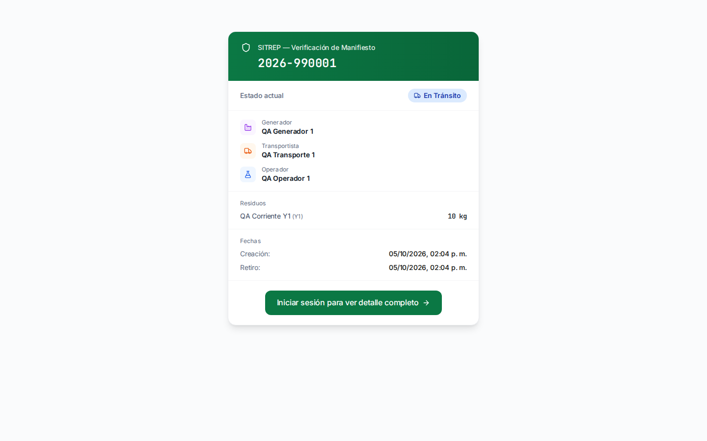

Cabecera pública corregida, appweb:


Detalleapp DESPUÉS, sinFAB sobre enlace:

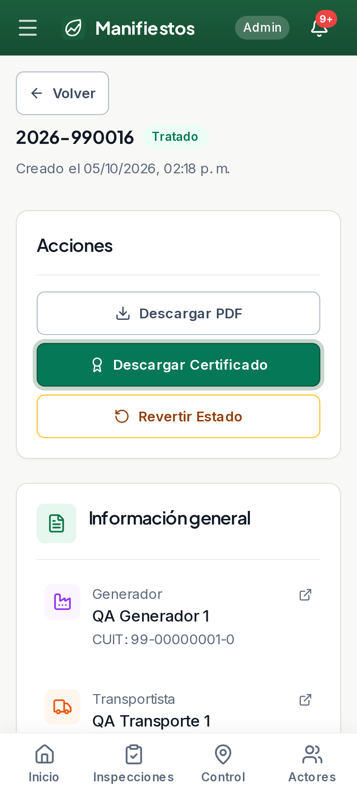

Ficha abierta desde elícono del detalle, sin afirmar suuniformidad global:

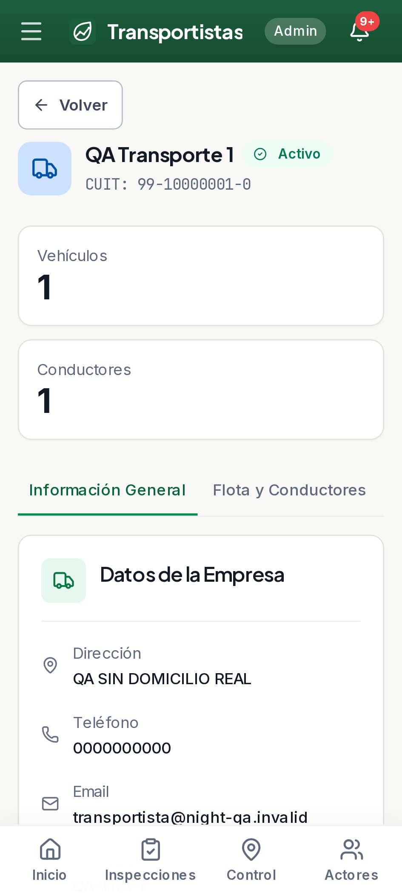

## Capturas QA82 — cabecera y filtros corregidos, pendientes visibles

Cabecera pública, escritorio:

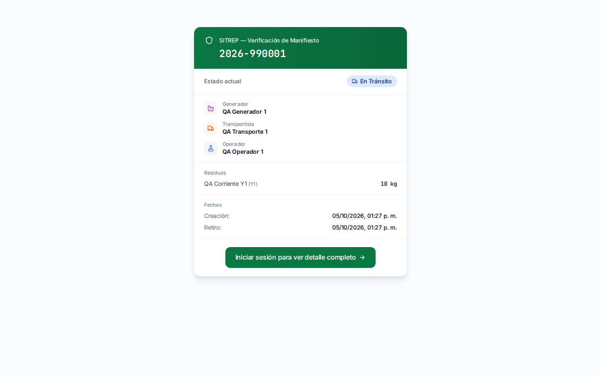

Cabecera pública, appweb:

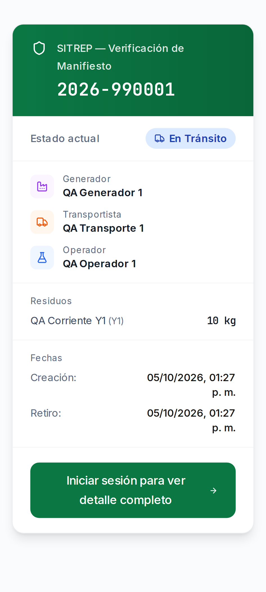

Referencias accionables, appweb320px:

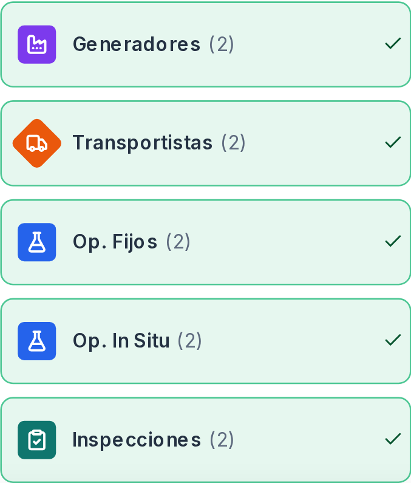

Monitor, pendiente NO aprobado:

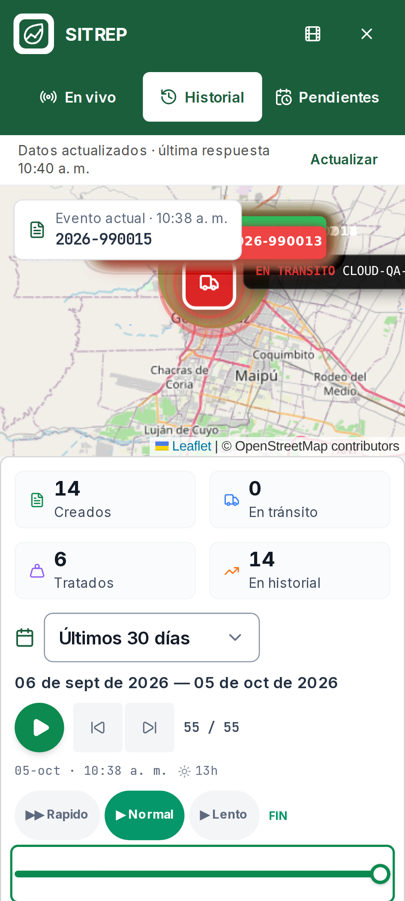

Detalleapp ANTES de acotar el FAB:

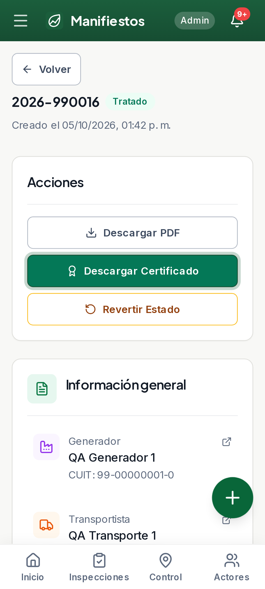

## Capturas originales QA78 — anteriores a la corrección del tilde

Escritorio, Centro de Control:

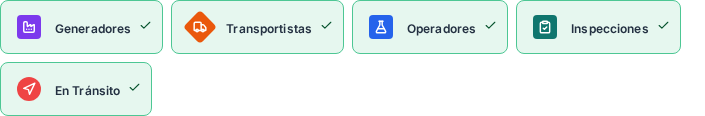

Responsive360px, Centro de Control:

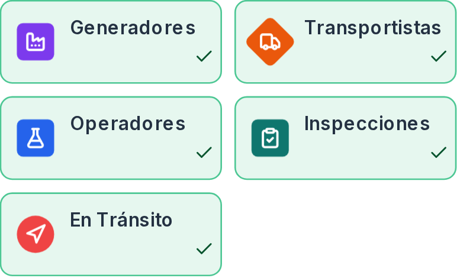

Appweb360px, Reportes:

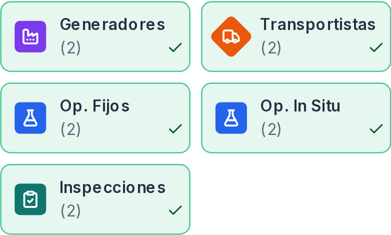

Appweb320px, etiquetas completas en una columna:

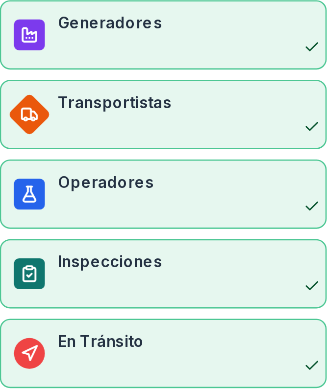
